# 数据科学基础

## 9.1

> ### 1.1 dikw

> ### 1.2 数据类型

#### -定类数据

​	-通常只代表不同的分类。数据没有数量含义，只用来识别种类

​	-它是没有顺序大小之分的较为低级的一类数据

​	-如0代表女，1代表男

​	- $\neq, =$

#### -定序数据

​	-定序数据是量化尺度的最基本形式，通常此啊哟数中表示顺序

​	-定序数据的每个分类不但有差别，而且有等级之分

​	-只是定个序，没有定量描述类别差距有多少

​	- $=, \ne, >, <$

#### -定距数据

​	-描述事物类别或次序之间的间距

​	-不仅可以区分事物并排序，还可以准确的指出类别差距多少

​	-可量化运算

​	-0是强行规定的，它不代表完全没有的意思

​	-没有绝对零点

​	- $+, -, *, /$

#### -定比数据

​	-与定居数据最大的差别：0是否具有实际的物理含义

​	-定比数据的零点代表了完全没有的含义

​	-定比数据需要统一的单位，比如米、千克等

​	-具有绝对零点

​	-比例除法

-高级别数据可以通过处理降为低级别数据，反之不行

> ### 1.3 数据汇总

### 集中趋势度量

#### -众数

​	-多用在定类变量的统计

#### -中位数

#### -四分位数

​	-从小到大排序后四等分，分为$Q_1, Q_2, Q_3$

​	-求近似的四分位数。

#### -（算术）平均数

#### -加权平均数

#### -几何平均数<--->对数的算术平均数

### 离散趋势度量

#### -全距（极差）

#### -内距（内四分距，$Q_3 - Q_1$）

#### -偏差平方和

​	-方差是偏差平方和的算术平均值，方差开方后是标准差

​	-定义式和计算式（可以证明是等价的）

### 课后思考题：

## 9.2 概率论入门

> ### 概率论

把物理世界的物品映射为数学元素

比如：把硬币的两面映射为0，1 则0，1称为样本点，集合$\set{0,1}$称为样本空间

### 基本事件

有一个样本点组成的单点集

### 复合事件

两个或以上个样本点

### 必然事件

全集Ω

### 不可能事件

空集Φ

> **意义：用数学（集合）语言描述事件**

### 频数、频率

​	-频率的收敛性：当频数n足够大时，频率趋向于某一个常数

### 无限集下的概率

​	-几何概率

### 概率定义

​	-非负性：$0 \le P(A) \le 1$

​	-规范性：$P(Ω) = 1$

​	-可列可加性：$P(A_1 \cup A_n \cup...) = P(A_1) + ...P(A_n)+...$

### 概率的计算

#### 条件概率

​	本质是在条件的前提下，使样本空间减少

#### 乘法公式

​	$$P(AB) = P(B)P(A|B)$$

​	$$P(ABC)=P(A \cup B \cup C)=P(C|A \cup B)P(B|A)P(A)$$

####  完备事件组

​	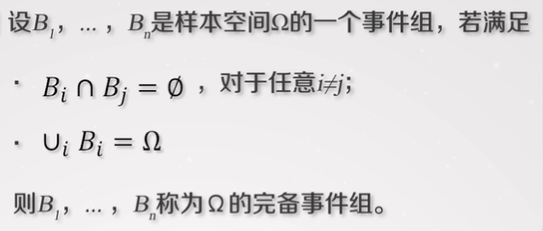

#### 全概率公式

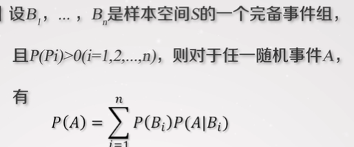

证明方法：

$$A = AS =A(B_1 \cup ...\cup B_n) = AB_1 \cup ... \cup AB_n$$

$$P(A) = P(AB_1) + ... + P(AB_n)$$

用乘法公式展开即可（S是样本空间）

##### 一个栗子

​	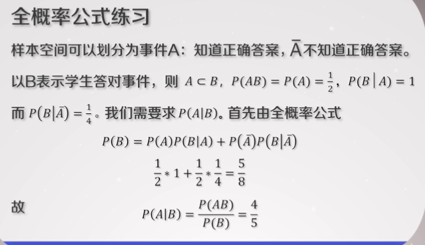

##### 课后练习

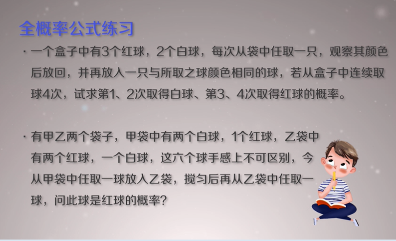

#### 贝叶斯公式

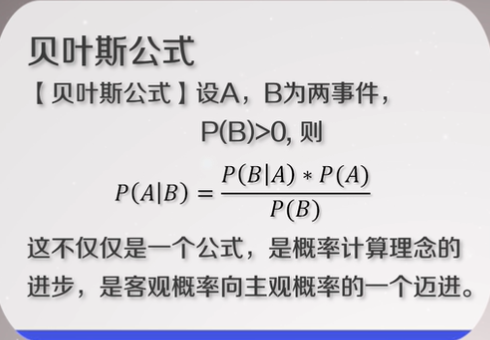

两个条件逆转之后计算概率

##### 练习

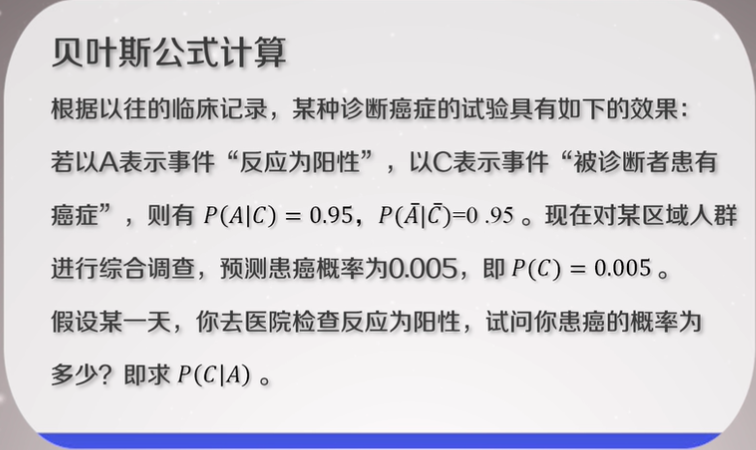

课本p20

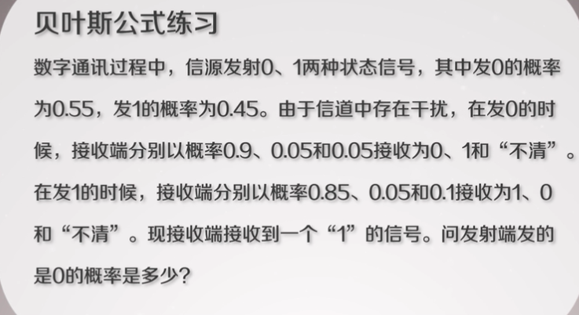

### 随机测试

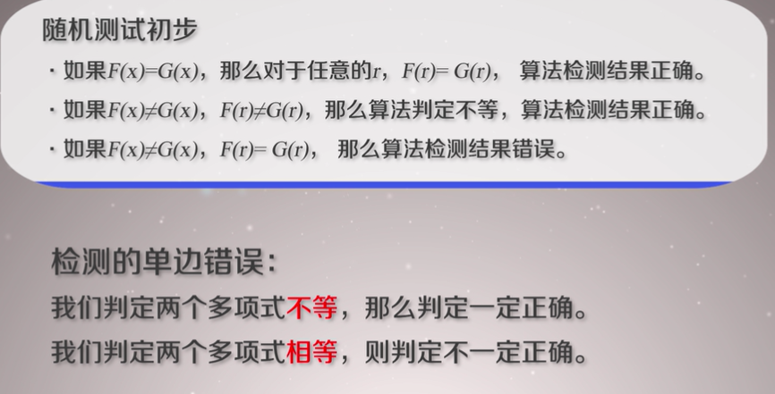

​	-如果r是方程F(x) - G(x) = 0的根时，必然会出现结果的错误。

​	如何提高检测准确率？

​		-重复多次的实验

## 9.9

> ### 概率分布

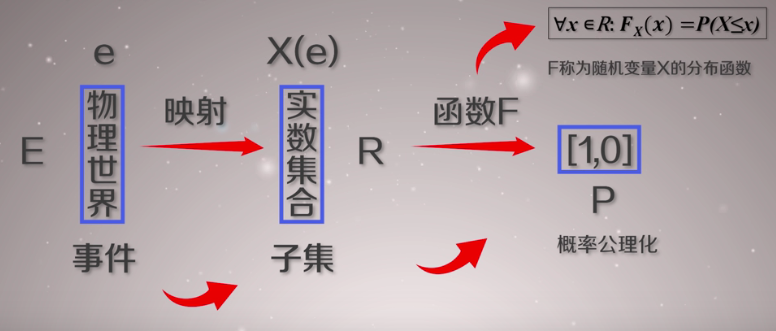

### 分布函数

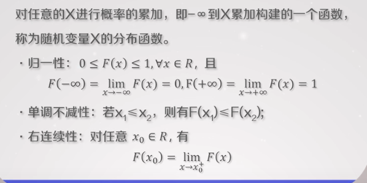

### 离散随机变量

​	一个随机变量X的可能取值为有限个或可列无穷个

### 连续随机变量

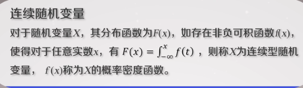

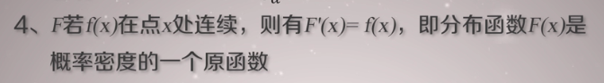

### 矩

#### 	原点矩

#### 	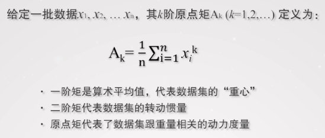

#### 	中心距

​	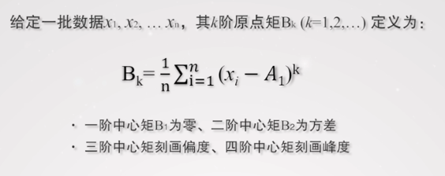

​	PS：$A_1$是算数平均值

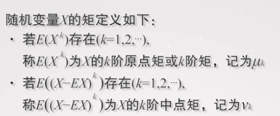

### 数学期望

#### 	离散随机变量

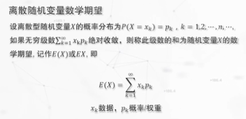

#### 	连续随机变量

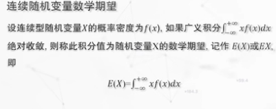

#### 	性质

​		-见课本

### 方差

​	-即$Var(X)$

​	-计算式：$Var(X) = E(X^2) - (EX)^2$

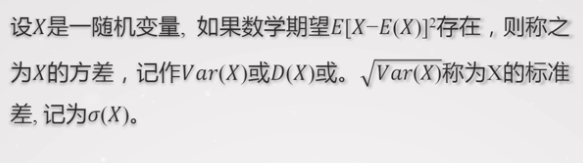

#### 性质

​	-见课本

### 离散随机变量

#### 	概率分布律

##### 		矩

#### 	伯努利分布(两点分布/0-1分布)

##### 		矩

#### 	二项分布

##### 		矩

#### 	泊松分布

​		在数值比较大的时候，二项分布和泊松分布比较接近，可以用泊松逼近计算

##### 			泊松分布的矩

#### 	几何分布

##### 		无记忆性

##### 		矩

#### 	超几何分布

##### 		矩

11月上旬期中考试（第11周 11.8 - 11.12，内容是教材1-6章）

