# 数据结构与算法

## chapter1、Data and Algorithm

> ###  Data definition：

is the carrier of information

Data is a set of numbers, characters and other symbols.

#### 	Data type

​		-is a set of values together with a operation set that operate on these values.

​		-大部分编程语言提供两种预定义的数据类型

​			-Atom data type ---- int, float, double......

​			-Structure data type ---- array, struct......

> ### What is Data Structure

a data structure is a data object(D) together with the relationships(R) among the data members that compose the object.


> ### ADT and OO

#### ADTs:

​	Abstract Data Types

​	是将类型和与这个类型有关的操作集合封装在一起的数据模型。

​		-Abstract: is a method used to hide the information.

​		-思想：将数据类型的使用与它的表示（机内存储）、实现（机内操作的实现）分开。更确切的

​		说，把一个数据类型的**表示**及在这个类型上的操作**实现**封装到一个程序模块中，用户不必知道他

#### OO:

​	object-oriented = object + class + inherit + communicate

​		-object: attribute values + operates

> ### Algorithm definition

#### Algorithm :

​	an operation sequence of soluting a problem

#### Properties:

​	-Input specified

​	-Output specified (算法是有输入和输出的)

​	-Definiteness (确定性、定性的，每一个算法都必须定义的很明确、书上的概念)（考研题考过）/ Deterministic（确定性算法，是算法的分类，算法包括deterministic和nondeterministic）

-确定性算法：对于一个固定的输入，算法有一个固定的输出

​	-Effectiveness

​	-Finiteness (有穷性)

> ### 算法思想

#### 1.Inducive

basis:

inducive condition:

inducive proof:

Q.E.D.

#### 2. Recursive 

​	C语言不断调用函数就是不断压栈的过程，每调用一个新函数则新创建一个栈空间

​	调用构成回路即构成递归!

​		eg: $f_1 -> f_2 -> f_3 -> f_1$

​	-牺牲执行效率，提高开发效率

​	$eg_1$ 全排列算法:

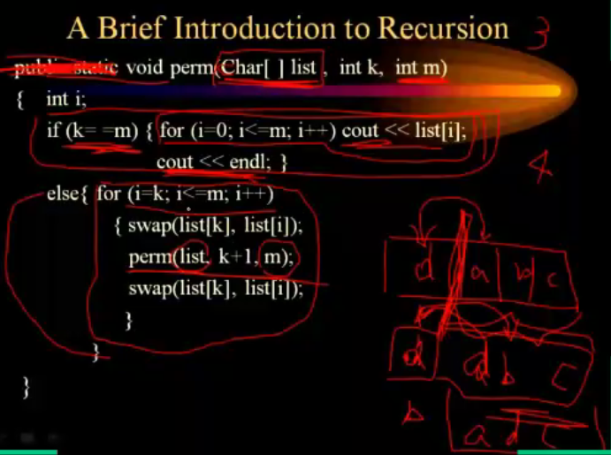

m是数组最后一个元素的下标, k是把数组分为两个部分的指标。

递归到m-1个元素的全排列和m个元素全排列的递推关系。

用循环找递推关系：每次把单独拿出来的元素跟后面全排列中的某一个元素交换顺序。

#### 2.运行时和编译

运行时（.exe)和编译是完全不同的两个概念

​	-应用举例: 运行时才能确定变量的大小, 所以编译时, 如果用变量作为数组的长度, 编译器无法确定数组的	大小, 从而报错!

​	In C++, the compiler must know the amount of memory to allocate for an array at compile time. However, the value of a variable is not known until run time. This is why you are not allowed to use a variable for the size of an array.


this在Java里对象的引用，在C++里是一个指针

> ### Generic Objects in Java

对于仅仅是参数数据类型不同的方法，可以使用“泛型”

## chapter2、complexity

### Space Complexity

​	-$S_{(n)}$

​	-指令空间

​	-数据空间

​	-栈空间

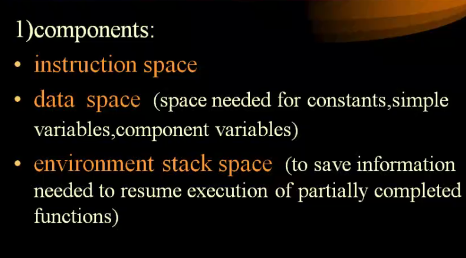

主要看运行时的动态占用空间

#### 12.22复习

- 导致内存开销1：定义变量

  - 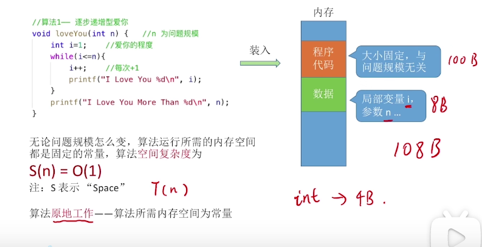

  - 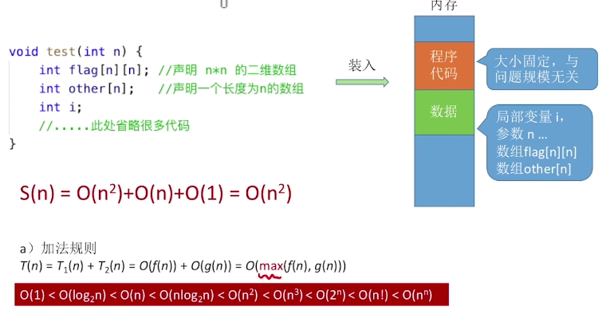

  - 同理，存储跟问题规模无关的变量不会计入考虑（只影响常数位）

- 导致内存开销2：递归调用

  - 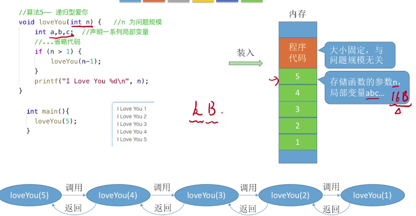
  - 复杂度 = 递归深度 * 每层的复杂度
  - 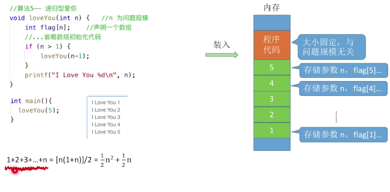

- 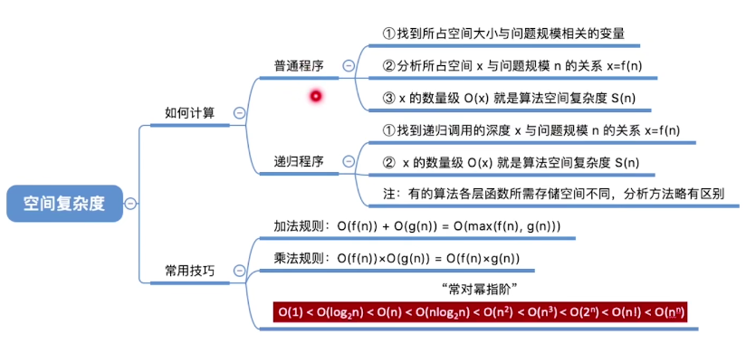

- 

### Time Complexity

- $T_{(p)}$

​	本质上是CPU的工作量

​	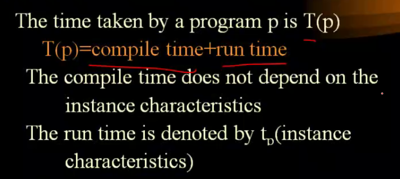

​	编译时间一般不算算法的时间复杂度

​	算时间复杂度也是粗略的算一下，只算主要消耗时间的步骤

#### 12.22复习

- 只考虑阶数最高的，只关注数量级

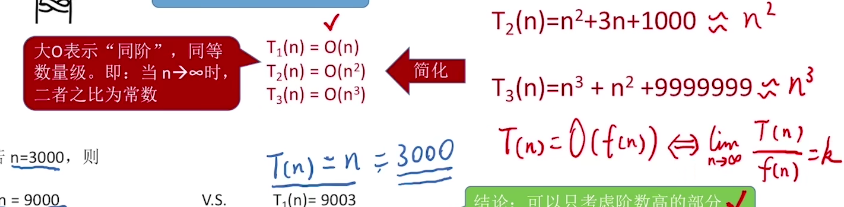

- 常见数量级


- 顺序执行的代码只会影响常数项，可以忽略
- 只需挑循环中的一个基本操作分析它的执行次数与n的关系即可
  - 常见题型：循环条件不是i++，而是i*2
- 算法情况通常分为最好情况、最坏情况和平均情况
  - 平均情况，所有输入等概率出现的情况下，算法的期望运行时间

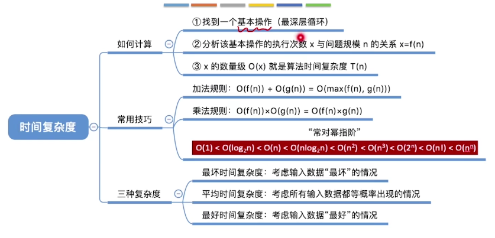

递归算法需要分析**基本操作**的执行次数和问题规模的关系

### Rank sort（秩排序）

​	先把数组里每个数的排名得到，然后再根据排名进行排序、调整

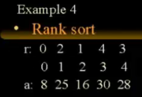

生成排名算法：

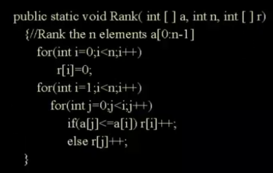

二重循环保证每两个数据都能比一次，两两比，一旦比过了rank++；


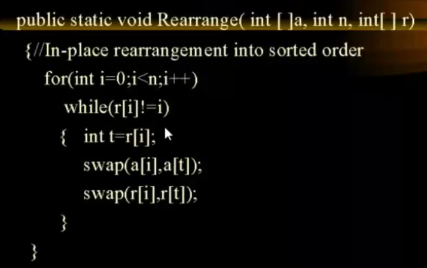

这个循环的目的是保证r[i] == i

### Sequential Search（顺序查找）

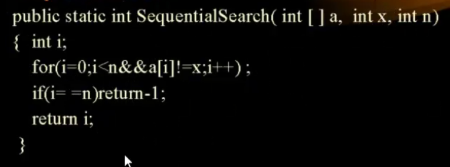

最坏情况：比较次数是n

平均情况：每种情况的概率加起来求算术平均

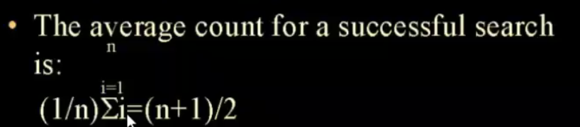

### Insertion sort（插入排序）

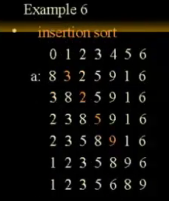

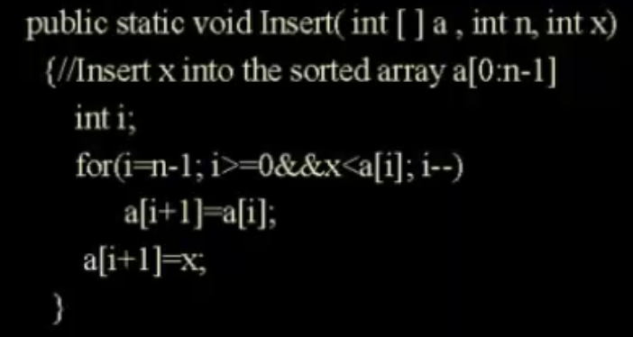

边比边调整数组，随时为x（待插入元素）腾出位置，最终直接插入

完整实现：

双重循环，最外层循环每次加一个a[i]


### 渐进时间复杂度

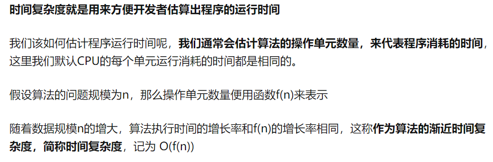


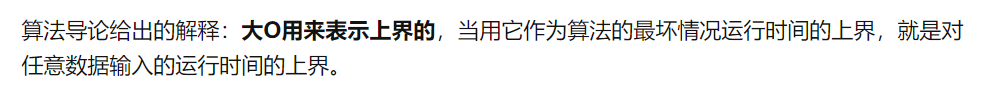

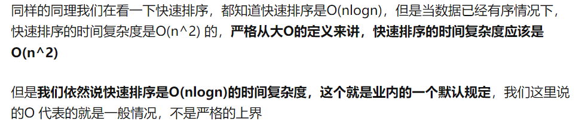

$O(0)<O(log_2n) < O(n) < O(2^n) < O(n!) < O(n^n)$

批注：计算机中对数默认为2

​				$O(0)$表示常数复杂度

做算法复杂度分析的时候**关注量级**


### Binary Search（折半查找）

可以把顺序查找的线性复杂度降为对数复杂度

把每次的数据和中间的数据比（前提是数据库是已经分好类的）


### 找最大子序列和

使用三重循环找到所有子序列，然后用一个标志位maxSum来记录最大子序列的和

优化1：只使用两重循环，第一层循环i定起点，第二层循环j定终点，然后每次加一个新元素只是在原有和的基础上加一个元素


### 算法思想：分治法

分：把问题分成两个大致相等的问题，使用递归等方法找到他们的解

治：把二者合并在一起，并通过一些附加工作得到答案

以找最大子序列的问题为例：把数列分为两半，先找两边的最大子序列，然后再从中间出发，找左右两边起点/终点固定的最大子序列，二者拼起来和左右两边的最大子序列比较

**注1：分治法通常是跟递归一起使用的，以此题为例，即：每次求左右两边结果的时候同样要使			 用分治法**

**注2：递归更多的是使用递推公式，而分治法则是平均二分**


看起来，好像算递归/分治算法的复杂度是看每次栈的复杂度 * 栈数

由此分析出分治法找最大子序列和的时间复杂度是$O(n * log_2n)$ [经计算，每次调用栈的复杂度正好都是n]


### Euclid's Algorithm（辗转相除法）

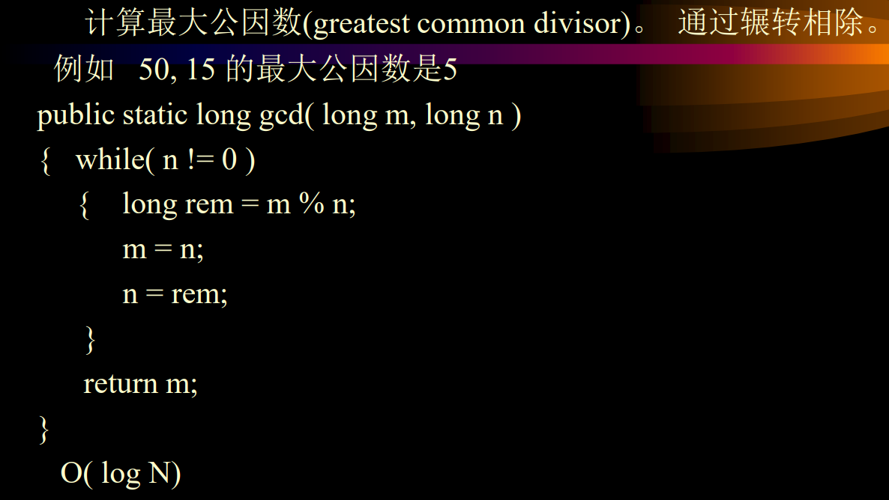

**算法思想：**

m -> n -> m % n -> n % (m % n) -> ...不停往后走一格

- eg： 30 7 -> 2 -> 1 -> 结束，最大公因数是1
- 首先明确：此算法的最坏情况是m和n互素，这样m和n相除的轮数尽可能多
- 然后从tail开始分析，为保证辗转相除的次数尽可能大，要保证在同等规模除的情况下，数据尽可能的小，因此：
  -  ... 13 -> 8 -> 5 -> 3 -> 2 -> 1（tail）
  - 正好是斐波那契数列
  - 比如要得到1000以内辗转相除法的最大迭代次数，即取1000以内最大的相邻两项斐波那契额数列，此时迭代次数即为斐波那契数列的项数 - 3
  - 斐波那契数列是对数量级的（可以用数列的递推公式来推导）
    - 因此此算法$O(f(n)) = O(logN)$


### $O(n)\ and\ Ω(n)$

- 课本P33 
- $o(n)$跟$O(n)$都表示最坏情况复杂度，但是$o(n)$表示算法无法达到该理论最坏复杂度


## chapter3、LinearList

### Set & Collection的区别

- Set强调元素只出现一次，而Collection无此要求
- Java里，Collection是List`, `Queue`, `Deque的父类，以它为接口可以提供更多多态选择
- Collection includes Set, as well as List.


### The List ADT

- 课本P43

- 线性表存在第一个元素和最后一个元素

- 每个元素由一维下标组成
- 除了首尾，每个元素有后继和前序

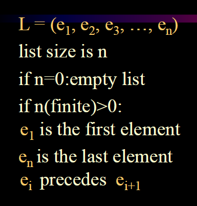

### 基本操作

- 创建
- 销毁
- 增
- 删
- 改（“改”之前也要“查”）
  - 如果是C++语言，参数要带有“&”：引用类型
- 查
  - 按值查找：LocateElem
  - 按位查找：GetElem

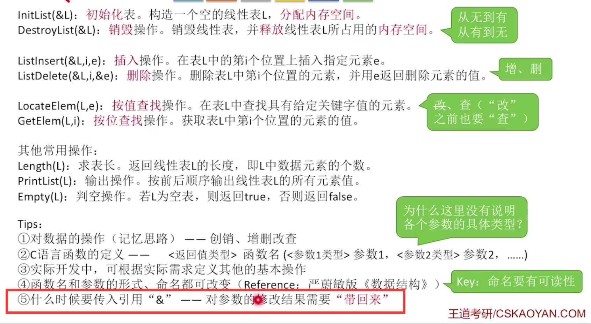

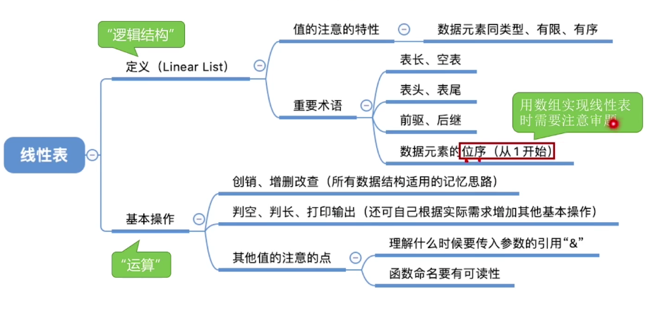


### 顺序表

- 是类似数组
- 静态分配

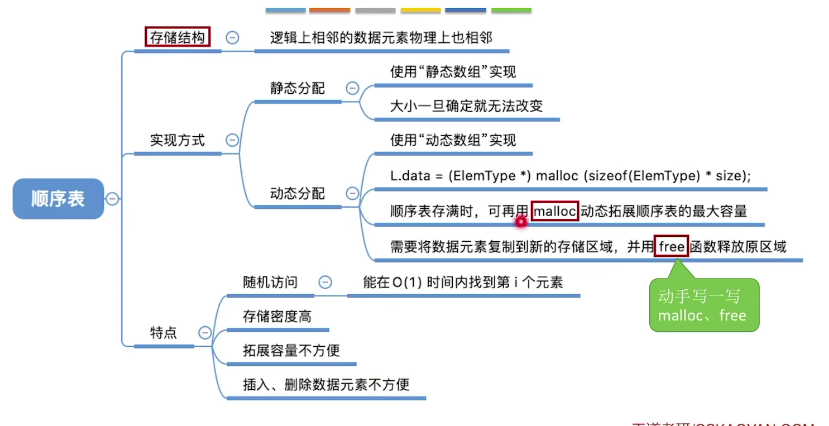

#### 操作

- 插入
  - 顺序查找
  - 将插入下标之后的元素都右移一位，然后插入元素
    - 是从后面的元素开始[i] = [i-1]
  - 注意鲁棒性：判断插入下标是否有效 & 当前存储空间是否已满
  - $O(n)$
- 删除
  - 顺序查找
  - 将插入下标之后的元素都左移一位
    - 是从前面的元素开始，[i-1] = [i]
  - 注意鲁棒性：判断删除下标是否有效
  - $O(n)$

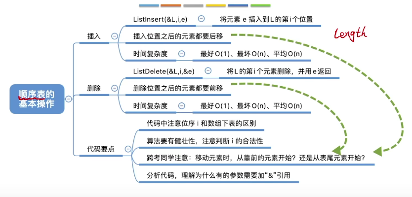

### Simple array implementation of Lists

- use an array to represent the instance of an object
- 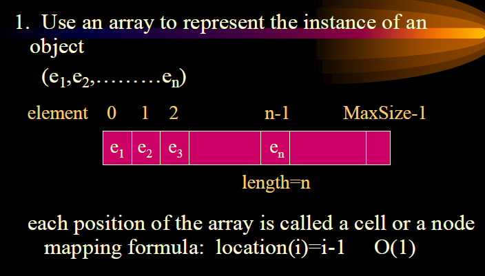


- PS：***ACN*** ： average comparison number
- 讲逻辑层的时候，下标起点为1；而讲物理层时，下标起点为0
- $remove(): O(n)$
- $insert(): O(n)$
- PS：***AMN*** ： average movement number
- **Merit:** easy search
- **Shortcoming:** insertion and deletion spend a lot of time


### Linked Lists

- 逻辑层和数组List一模一样，但是物理实现是通过单向链表实现的
- 删除首结点，Java和cpp操作不一样
- Java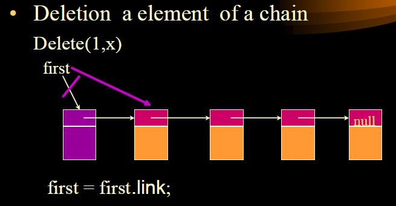
- 而cpp要把first = first.next; delete[] first;
- 删除中间节点，需要before指针指向删除结点的前一个结点。Java仍然只需要一句代码
- 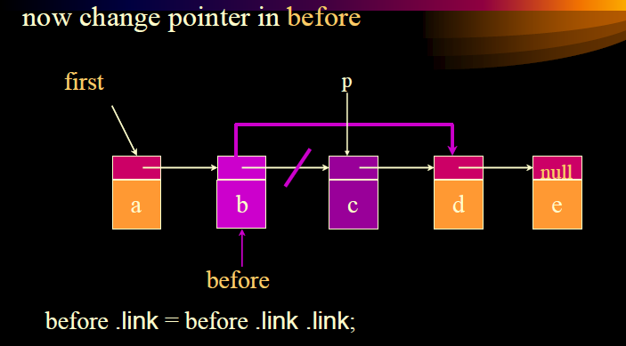

#### 带表头结点的链表Header（dummy node）

- 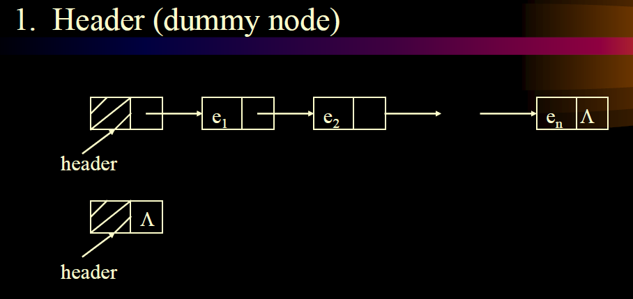
- 从第二个结点才开始存放数据
- header结点的数据区不放东西

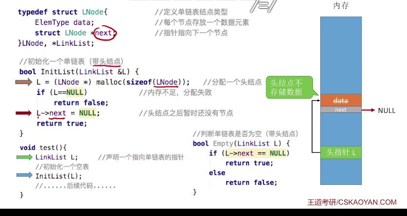

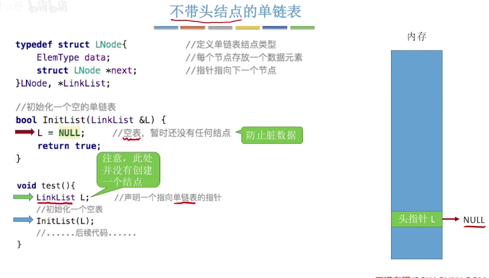

- 带头结点的链表，代码量相对于不带头结点的更少

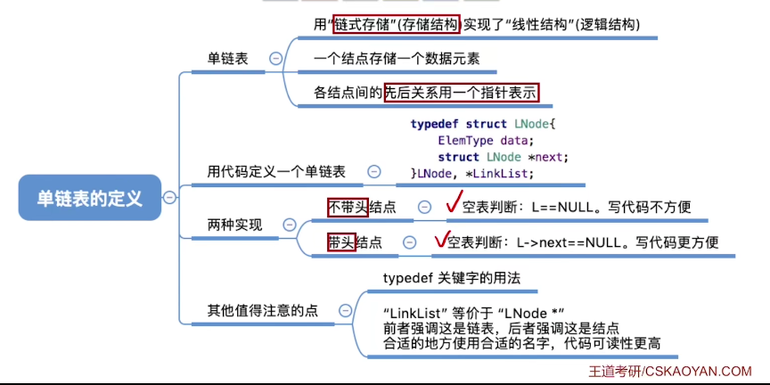

- 默认的单链表是不带表头的单链表

#### Java中关于单链表的实现

- Class definition
  - ListNode —— 代表结点的类
  - LinkedList —— 代表表本身的类
  - LinkedListItr —— 代表位置的类（游标类，指向当前位置的引用/指针）
  - 以上都是包DataStructures的一部分

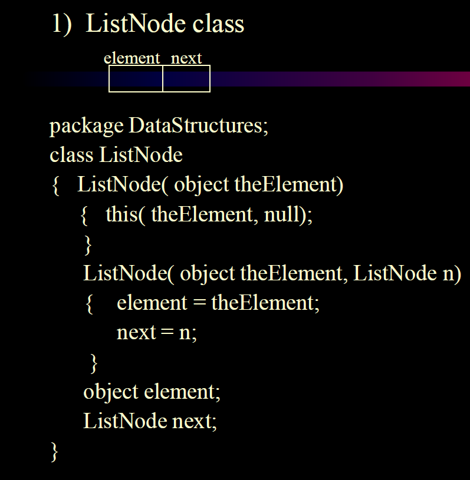

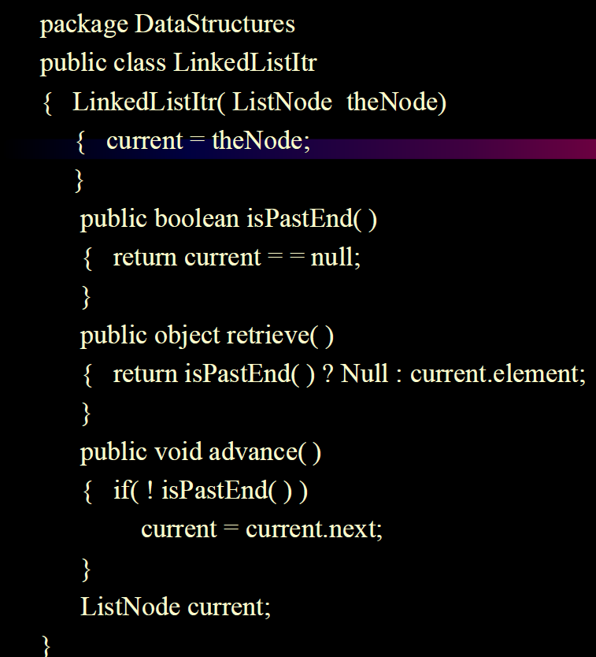

- 此处认链表是带头节点的单链表

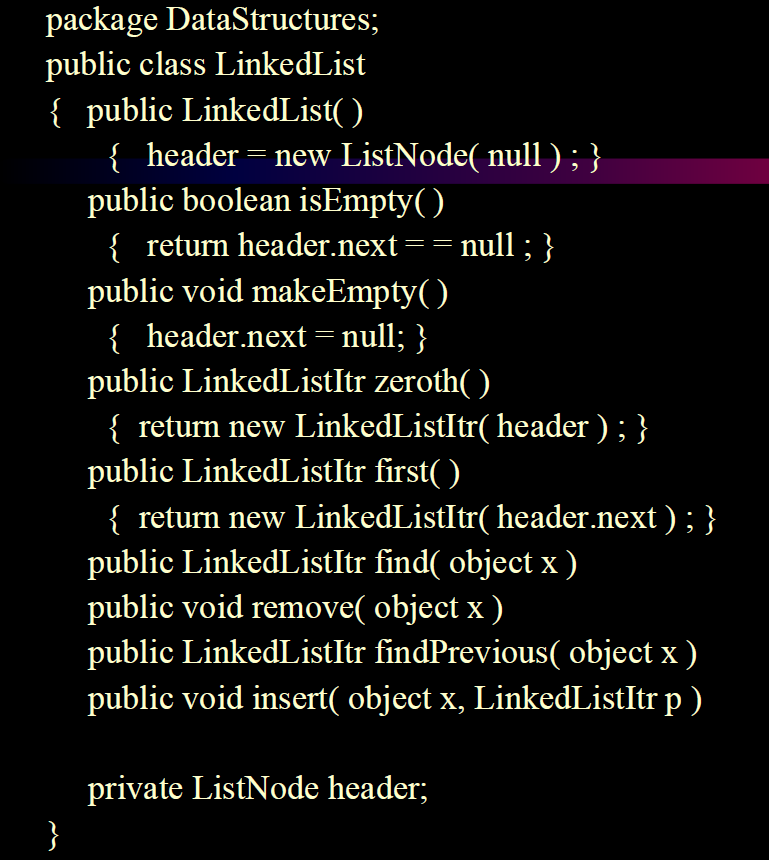


#### 相关操作代码

##### 插入

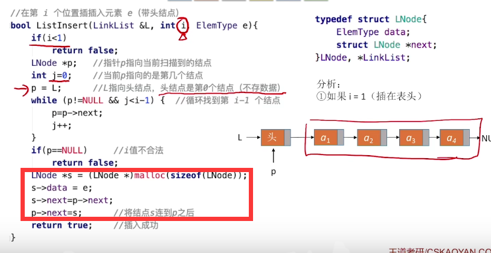

- 红框的倒数第二第一行不能颠倒
- 插入的是第i个结点，所以只需要找到第i-1个结点即可
- 检查不合法的方法是检查p是否为null
- 刚开始让申请的LNode指针p指向表头
- 如果是不带头结点版本的
  - 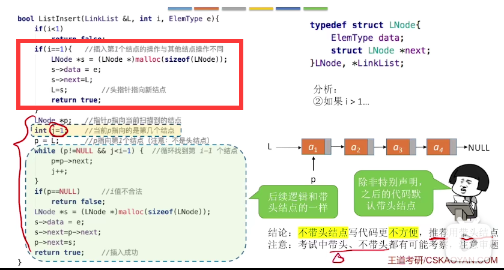
  - 要对第一个元素的插入进行特判

###### 后插

- 给定后插元素，执行上上图红框操作

###### 前插

- 偷天换日法
  - 尽管给定结点元素的前面未知，后面已知
  - 可以通过在结点后插入元素，然后交换结点值，达到逻辑前插的效果
  - 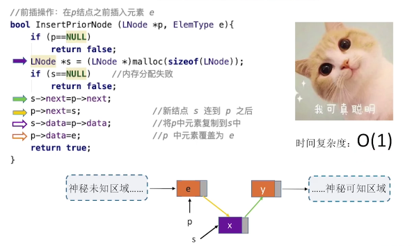

##### 删除

###### 按位序删除

- 找到待删除结点的前一个结点

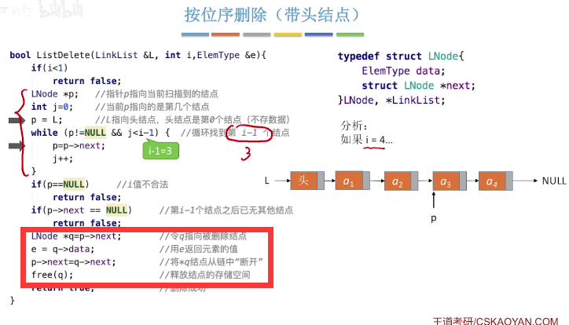

###### 指定结点删除

- 偷天换日操作
  - 声明一个指针指向指定结点p的后继结点
  - 把后继结点的值放到指定结点p中
  - 然后删掉后继结点，达到逻辑删除的作用
  - **但是无法当p是最后一个结点的时候会出bug！**
  - 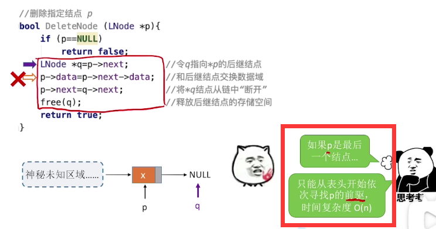

##### 查找

###### 按位查找

- 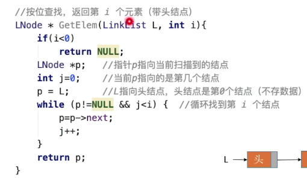
- p！=NULL是防止i过大的异常，j < i防止的是i过小的情况

###### 指定结点查找

- 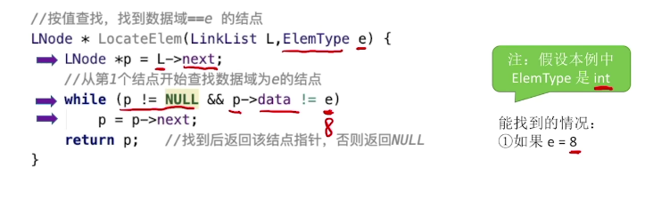
- p ！= NULL表示没找到
- 顺序扫描

#### 相关操作复杂度

- 数据查找 find - O（n）
- 删除结点 delete - O（1）
- 插入结点 insert - O（1）

#### 单链表的建立

##### 尾插法

- 采用后插操作
- 设置一个表尾指针，保证该指针指向尾部元素
- 把尾部的next置成新元素，然后重新set表尾
- 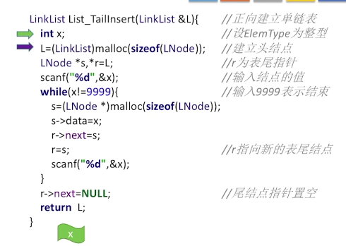

- 最后在循环外让尾结点的next为null

##### 头插法

- 总是在链表头后面插入新节点

- 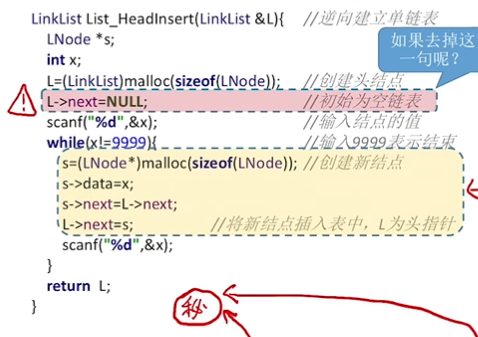
- 新元素的next置成表头的next，然后重新set表头
- 重要性质：**链表的逆置**
- 将输入数据逆序存入链表
- 原地逆置：取链表元素重新插回头结点

#### 线性链表的其他变形

##### 双向链表（doubly linked list）

- 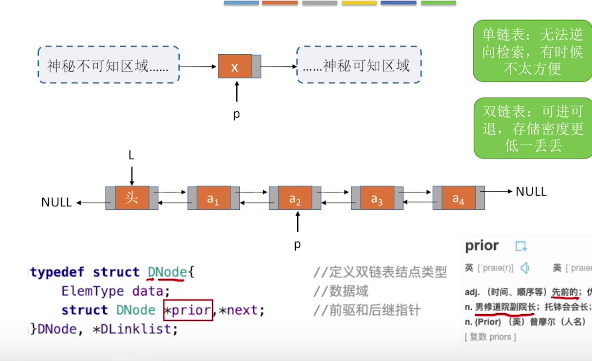
- 初始化
- 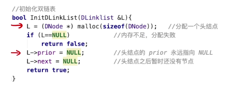
- 插入操作
  - 一般只有两个指针p和s，所以取到γ要用p -> next
- 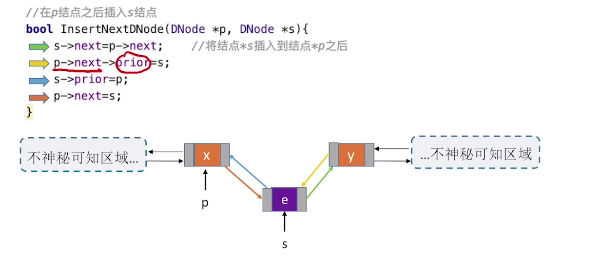
- 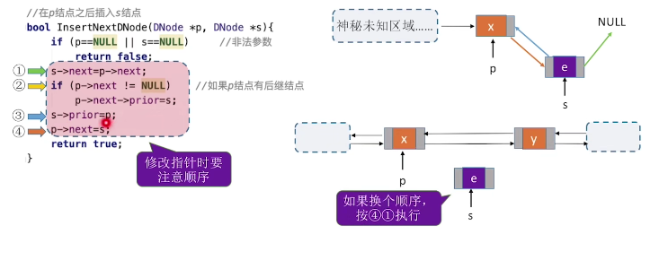
  - 是为了防止插入在为节点后，增强代码鲁棒性，防止空指针异常
- 删除
- 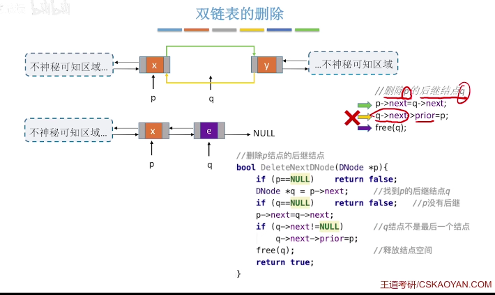
- 下面的代码是防止删除尾结点的情况，增强代码鲁棒性
- 查找操作
- 
- O(n)

##### 循环链表

- 初始化：让头结点的指针指向它自己
  - 检查是否为空也只需要检查头结点的指针是否指向自己
- 
- 是否到达表尾
- 
- 优点是方便找到表头和表尾，适合经常操作表头和表尾的场景
- 当使用循环**双链表**时，插入删除时不用再对表头表尾元素特判

##### 静态链表

- 在内存中连续存放的链表


- 初始化：把头结点的游标设置为-1
- 插入
  - 找到一个空的结点，存入数据元素
  - 从头结点出发找到位序为i - 1的结点
  - 修改新结点的next
  - 修改i - 1结点的next
- 删除
  - 从头结点出发找到前驱结点
  - 修改前驱结点的游标
  - 被删除结点enxt设为-2（规定的空结点游标的特殊值）
- 

# 复习：2.3.6

#### Josephus问题

- 使用循环单链表，依次计数，然后每次删去第m个结点并打印该结点编号，当只剩下一个结点的时候结束算法

```c++
void Josephus(CircList<T>& Js, int num, int count){
    //the first param points to the first node of Js
    CircList<T> *p = Js.Locate(1), *pre = NULL;
    for(int i = 0; i < num - 1; i++){
        //count n-1 times, eventually remain one person.
        for(int j = 1; j < count; j++){
            //find the to be killed person.
            pre = p;
            p = p -> next;
        }
        //print message.
        cout << "The person to be killed is " << p -> data << endl;
        //delete the node.
        pre -> next = p -> next;
        //update the head pointer.
        if(first == p) first = p -> next;
        delete p;
        //important step! ensure next loop of program can run!
        p = pre -> next;
    }
    cout << "Eventually "<< first -> data << " survived!" << endl;
}
```

- 术语批注: rhs = right head side; lhs = left head side
  - 指的是operator左右两边的元素

#### 多项式计算

##### 数组实现

###### 思路

- 使用稠密表示
- 定义一个系数数组，数组下标和指数对应
  - 比如最高指数是1000，那么数组的下标至少要留到1000


###### 类定义


###### 操作


##### 单链表实现

- 使用稀疏表示
- 课本P76

###### 类定义

```c++
struct Term{
    float coef; // 系数
    int exp; // 指数
    Term *next;
    //有参构造函数
    Term * InsertAfter(float c, int e);
    friend ostream& operator << (ostream&, const Term&);
}

class Polynomial{
   private:
    Term* first;
    friend ostream& operator << (ostream&, const Poynomial&);
    //友元函数，重载 >>
    //友元函数，重载+
    //友元函数, 重载*
    
   public:
    Polynomial() {first = new Term(0, -1);}
    Polynomial(Polynomial& R); //复制构造函数, 利用已有多项式对象R初始化当前多项式对象
    int maxOrder();//计算最大阶数
    Term* getFirst(){ return this.first; };
    
}
```

###### 操作

- 对于两个待加链表, 分别添加两个检测指针pa, pb, 依次扫描并比较exp域, 合适时完成coef域运算


#### 例题


用两个指针记录？将一个指针移动到与另一个指针相距为k的地方，然后两个指针同时向后移，后一个指针指到null的时候前一个指针就是倒数第k个节点？（如果链表长度小于k的话进行特殊的判断）


### Radix Sort（计数排序）

按照进制的个数创建n个桶

然后依次按照数据的第1位进桶出桶、第2位进桶出桶...第n位进桶出桶

直到所有位数都进桶出桶，即排好数据


## chapter4、Stack & Queue

### Stack

- 定义
  - 只能在同一端插入和删除数据的数据结构
  - 插入和删除数据的一端叫栈顶，另一端叫栈底
  - LIFO（last-in-first-out）
- 基本操作
  - pop
  - push
  - peek
  - 创、销、增、删、改、查
  - 
- 栈顶
  - 通过它来判断栈是否满、空，得到栈里元素的个数
  - 为0，表示还有一个元素
  - 为-1， 表示没有元素了


#### 实现

##### 链表

（一般定义栈顶为topOfStack，如果top == null，栈空）

- 规定只能在链头进行插入、删除操作
- 其余和单链表操作是一样的

##### 数组

（一般定义栈顶为数组最末尾元素的下标，数组事先定义一个MaxLen，如果top == -1，栈空）

- **入栈**：先把栈顶指针+1，然后再新元素入栈(S.data[S.top] = x)
  - S.data[++S.top] = x;
- **出栈**：先把栈顶元素出栈，然后将栈顶元素 - 1
  - x = S.data[S.top--];
- 栈满的条件：top == MaxSize;
- **共享栈**
  - 
  - 两个栈顶指针相向增长，逻辑上在同一片物理空间实现一个栈
- 所有的操作都是$O(1)$

### 应用

#### 表达式括号匹配

- 核心：最后出现的左括号最先被匹配（LIFO）
- 每出现一个右括号，就消耗一个左括号
- 流程图
  - 
- 
- 总结：
- 

#### 表达式求值

- 多考察后缀表达式
- 中缀转后缀
  - 
  - “左优先”原则：只要左边的运算符能运算，就优先左边
- 栈实现思路
  - 
  - 此时栈是存**操作数**
- 中缀转前缀
  - 
- 栈实现思路
  - 

#### 中缀转后缀

- 操作数的顺序不会变
- “左优先”原则：因此遇到运算符后，可以放心大胆的弹出优先级大于等于它的运算符

- 
- 此时栈是用于存**运算符**
- 因此可以开两个栈，一个存**运算符**，一个存**操作数**，可实现**中缀表达式计算**（边转后缀边计算）


# 一定要把此用代码写一遍！


### Queue

- 一端进，一端出，不得插队

#### 基本操作


#### 实现

- 数组

  - rear指向队尾元素的**后一个位置**，front指向队头元素
    - 初始化：front和rear都指向0

  - 如果**rear == front**，队为空
    - 逻辑上把线性存储空间变为环状空间：
    - 

  - 判断队列是否已满：
  - 
    - 注意：这里为了保证判断队空的条件，总是牺牲了一个存储单位！即队满的时候实际上还有一个单位没有存放元素

  - 出队
    - 

  - **求队列元素的个数**
    - (MaxSize + rear - front) & MaxSize;

  - 如何在不浪费空间的情况下实现队呢？
    - 加入size变量记录队列长度
    - 
    - 加入tag变量，记录最近进行的删除还是插入
    - 

  - 其他初始方法：
    - 

  - 尾指针初始化为
    - 


  

  - To add an element:  back=back+1; theArray[back]=x; 
  - To delete an element: two methods: 
    - front=front+1; O(1) 
    - shift the queue one position left; O(n)
  - 技巧：把数组视作环


- 单链表

  - 只能在单链表表头删除，只能在单链表队尾插入
  - 标记*front 和 *rear两个指针

  - 
  - 插入
    - 插入的结点一定是尾结点
    - 
    - 
    - 特判头结点（插入的是第一个元素）
  - 删除
    - 
  - 如果要统计队列长度，只能$O(n)$的方式遍历，并计数
    - 可以在结构体里加一个length来记录，以改善复杂度

#### 双端队列

- 允许从两端插入、两端删除的队列
- 
- 只要在**栈和队列**里是合法的输入输出顺序，在双端队列里一定是合法的

# 再看P25！

#### 应用

##### 打印杨辉三角

- s是队首的缓存

- i的for循环表示打印第i行

- k的for循环表示打印数据前的空格，这里认为10是杨辉三角长度的一半

- 然后再进一个0，表示末尾的0，用来和最后的1相加生成下一行的末1

- 第三个for循环表示第i行要处理i + 2个数据

- 然后每次出队数据，并新进一个数据

- 最后的if是保证不打印队列最后的0
  - 而最后的0正好出队，作为变量t赋给s，成为下一行的s（队首缓存）


##### 树的层次遍历

##### 图的BFS

##### FCFS（操作系统服务策略）

##### 打印数据缓冲区


## chapter5、Tree

### 定义

- a tree T is a collection of nodes(element)
- The collection can be empty
- otherwise a tree consists of  a distinguished node **r** called the **root**, and zero or more nonempty **sub trees $T_1, T_2, ..., T_k$**

一般把根结点画在上

- **每一个结点只有一个前驱！**
- 直接前驱：父亲；直接后继：孩子；同前驱：兄弟
- 路径：从上往下的结点；路径长度：边的长度
- 结点的**度**：有几个孩子（分支）
- 树的度：各结点的度的最大值
- 结点的层次（深度）：默认从1开始（有时候也会从0开始）

#### 度数

- 与图论中的“度”不同，树的度是如下定义的：有根树T中，结点x的子女数目称为x的度。也就是：在树中，结点有几个分叉，度就是几。
- 树中结点数 = 总分叉数 +1（代表根节点）。(这里的分叉数就是所有结点的度之和)


### 常考性质：


- 考点4：等比数列求和问题


- 考点6：尽可能往宽着长，其实就是解$n < \frac{m^h-1}{m-1}$

### 二叉树

每个结点只有两个or一个子树，分为左子树和右子树

- 性质
  - 如果n个结点，边必定是n - 1
  - 第i个结点的个数$\le 2^i$
  - 树叶（度数为0的结点）个数为$n_0$，度数为2的结点个数为$n_2 + 1$
  - 结点数为n的二叉树最大高度和最小高度的推导（只有一条主分支 and 全是二分支）
#### 满二叉树：
- 所有层的位置全部占满的树
- 
- 
#### 完全二叉树：
- 满二叉树按照顺序删掉若干结点后的树
  - 意义：完全二叉树强调结点的位置，每一个结点在树里的位置是固定的
    - 因此可以用编号来表示结点，
  - PS: 编号默认从0开始编, 最后一个结点的编号是n - 1
  
  
  
  - 性质:


PS：（2）中的表达式是向上取整

- 特别适合用数组实现

#### 二叉排序树

- 左子树的结点关键字一定小于父节点，右子树的结点关键字一定大于父节点


- 适合元素的排序和删除

#### 平衡二叉树


- 拥有更高的搜索效率
- 希望树找的越胖越好，让搜索深度降低

#### 常考性质


- 这个是向上取整


- 这个是向下取整


- 由完全二叉树的结点总数可以推知其各度数结点的个数

#### 物理实现

##### 顺序存储

模拟完全二叉树进行实现 --> 把完全二叉树的编号看作数组下标

如果实现的是非完全二叉树，则可以把其看成若干位为空的完全二叉树

- 适用于模拟完全二叉树/类完全二叉树（缺的结点比较少的）


eg：


- 但是此时判断是否有左孩子右孩子等不能再用**n**了，需要在每个数组元素里面额外加一个“isEmpty”字段，通过计算i得到对应数组下标，然后查看“isEmpty”字段


##### 链式存储


有时为了方便找到父结点，加一个parent指针，变成**三叉链表**


- data字段跟树的功能有关
- 左右是指针（引用），指向左右子节点
- 甚至可以用静态链表来表示


- 创建结点时是从下往上构建的（从上面添加结点）
- 删除结点时从上往下删，是makeTree的逆操作

#### 二叉树的遍历

##### 遍历类型


- 手写树的前中后序遍历的时候可以模拟**递归思维**

  ------

  

- 策略：递归每一次遍历分为V（结点）、L（访问左子树）、R（访问右子树）
- 根据遍历左子树的顺序，分为前序遍历、中序遍历、后序遍历
- 而另外一种遍历策略是level order（层次遍历），即按照每一层从左往右遍历

##### Preorder


##### Inorder


##### Postorder


- 以上算法复杂度：$O(h)$ ($O(h+1)$)

##### 遍历算法的应用：求树深度


##### 层序遍历

- 使用队列
  - 每访问一个结点就把该结点的左右孩子入队


------

- 思考技巧：从最底层左边leaf开始看，逐层套遍历规则。（模仿递归，递归本质也是从最后一层开始出栈）


##### 深度优先

- 见“层序遍历”

##### 广度优先


- 注意：物理层二叉树的**中序**遍历和逻辑层树的**后序**遍历相同

##### 用栈实现树的遍历

总体来说有2层循环，while和栈结构控制递归。当指针p指向新一个结点且轮到while时，代表进入下一个递归。

算法很精妙！慢慢体会

###### Inorder


###### Postorder

对于后续遍历来说，需要对每一个结点加一个tag，记录是从左子树回来的还是右子树回来的

如果当前指针为空，代表该分支子树已经遍历完。此时返回到父结点，无论如何都先将其pop出来

- 如果父结点tag为0，则将其tag修改为1后重新push入栈，然后开始遍历其右子树
- 如果父结点tag为1，则将其打印并继续pop栈，将p指向上一层结点


### 建立二叉树

- 结论：若只给出一棵二叉树的前/中/后/层序遍历序列中的一种，不能唯一确定一棵二叉树

输入一个String，系统基于String调用相应算法进行创建

#### 利用先序、中序构造


- 递归调用构造即可

ABDCEGFHI

DBAEGCHFI


- 也是一层一层的手推即可

  ------

#### 利用二叉树的广义表构造

A(B(D), C(E( , G), F(H,I)))


- 先通过先序遍历找到整个树的根节点
- 再通过顺序查找找到中序遍历的根节点下标
- 则对于prestemp，其（1，inpos）的substr即为左子树
- 对于instemp，其（0，inpos - 1）的substr即为左子树
- 然后递归调用createBT，其中根节点指向原根节点的左子树
- 右子树处理方法相同

### 树的存储结构

- 广义表表示
- 双亲表示法（顺序存储）
  - 每个结点中保存指向双亲的“指针”
  - 缺点：查指定结点的孩子只能从头遍历


- 左子女-右兄弟表示法（常考！）（链式存储）
  - 用于树和二叉树的转换！
  - 优点：可以用我们熟悉的二叉树操作来处理树


- 如果根节点a有右子树的话，说明原树是一个森林


- 应用：利用二叉树表示广义树


- 给原树根节点插入子结点方法


### 森林和二叉树

#### 树 -> 二叉树

- **1.加线**。在所有的兄弟结点之间加一条线。
- 
- **2.去线**。树中的每个结点，只保留它与**第一个孩子结点**的连线，删除其他孩子结点之间的连线。


- **3.调整**。以树的根结点为轴心，将整个树调节一下（第一个孩子是结点的左孩子，兄弟转过来的孩子是结点的右孩子）


- 最终结果为


#### 二叉树 -> 森林

- 根据孩子兄弟表示法，**根节点是没有兄弟的**。

  前提：加入一棵二叉树的根节点有右孩子，则这棵二叉树能够转换为森林，否则转换为一棵树。

- **1.删除右孩子连线。**

  从根节点开始，**若右孩子存在**，则**把与右孩子结点的连线删除**。再查看分离后的二叉树，若其根节点的右孩子存在，则连续删除。直到所有这些根结点与右孩子的连线都删除为止。


- 2.**将每棵分离后的二叉树转换为树**。


### 线索二叉树	

#### 定义及性质

- 为了充分利用n结点二叉树的2n个链域（指针）
- 好处是可以使前驱、后继等运算更快
- 在二叉树的n+1个空指针中放入一些线索化指针

一个栗子


- 代码结构


- 使用tag位来标记左右指针是否指向的是前驱 & 后继


- 线索二叉树一共有$n+1$个空链域（$n$是树的结点数）

#### 中序线索化


- 定义全局变量pre，用来指向当前访问的结点p的**前驱**
- 在中序遍历中，最后一个访问的结点一定没有右孩子

*线索化 P5.3.5*

#### 中序遍历原理

有了线索树之后，遍历等操作不需要递归和栈了

代码：

- first（）函数负责找到树中序遍历的第一个结点：即一直往左走到头
- next（）函数先把p指向current->rightchild
  - 如果rightchild是后继，即为所求
  - 如果rightchild是右子树的根节点，则**找到右子树最左边的结点**（即找到右子树的first（））


- 如果找前驱
  - 如果rightchild是前驱，即为所求
  - 如果rightchild是左子树的根节点，则**找到右子树最右边的结点**


*先序后序算法P5.3.6*


#### 中序遍历算法


好处：降低算法复杂度

#### 构造中序线索树

对已存在的一棵二叉树建立中序线索树 

- 分析： 与中序遍历算法差不多， 但是要填左空域 右空域的前驱、后继指针。 所以除了流动指针p外， 还要加一个pre指针，它总是指向遍历指针p的中序 下的前驱结点。


算法流程类似于用栈实现中序遍历二叉树

但是之前的算法中，当遍历到指针域为空时，要cout操作

此算法把cout操作改为初始化指针域即可


### 增长树

- 定义
  - 对原二叉树度数不满2的结点，补空树叶，使之度数为2

- 外通路长度（外路径）
  - 所有空树叶到根节点的长度之和
- 内通路长度（内路径）
  - 跟到每个内节点（非叶子） 的路径长度之和（边数）
- 以上两种通路长度都可以加权

### Huffman Tree

- 给出m个实数$W_1,W_2...W_m, m \ge 2$作为m个外结点的权构造一棵增长树，使得带权外路径长度最小。


#### Huffman算法


算法思想：贪心

当权重都是一样的时候，平衡态总边数最小，此时霍夫曼树是平衡态。

- 每当一个结点的距离减一，一定有另外两个结点的距离加一

#### 霍夫曼编码

- 特点
  - 电文的总长度最短
  - 任一字符的编码不是另一字符的编码的**前缀**（为了译码）


左子结点标0，右子结点标1是为了人为制造一个二进制串


#### 译码


## chapter6、Specific tree

### 二叉搜索树


### 带索引的二叉搜索树

- 在二叉搜索树的每个结点加一个“leftSize”字段，leftSize = number of the nodes in left subtree + 1


#### 代码定义


#### 基本操作


- findMin 是从树根开始，往左走到底；findMax 是从树根开始，往右走到底
  - 
- find方法实现
  - 
  - 算法复杂度是一个树高


- 二叉搜索树的查找算法
  - 本质还是二叉树的查找算法
  - 如果待插入结点就在树中，则什么都不做
    - 最后一个else
  - 否则按照待插入数据的大小，将其插入到合适的位置
    - 如果比树根的key小，插入左子树，然后递归（插完的子树作为新的左子树）
    - 如果比树根的key大，插入右子树，然后递归（插完的子树作为新的右子树）
  - 算法复杂度也为树高，$O(h)$


- 二叉搜索树的删除算法
  - 首先搜索到待删除结点
    - 待删除结点是一个叶子 -> 直接删之
    - 待删除结点有一棵子树 -> 删之，然后把其子树与其根节点连接即可
    - 待删结点有两棵子树 -> 删之，用其左子树的最大结点or右子树最小结点替换其位置
      - 替换结点的操作本质上也是删除操作，所以是递归操作
        - 只不过替换的结点必然不可能是有两颗子树的结点，因为是max OR min


- 第一个if：空树情况
- 第二个if以及第一个else if：查找
- 第二个else if：第三种情况，要删的是t
  - 先把此结点的数据替换为右子树的最大结点数据
  - 然后递归地删右子树的最大结点
- 第三个else：第一种情况或者第二种情况，要删的是t
  - 第一种情况：当前结点变为空
  - 第二种情况：连接非空子树

### 自平衡的二叉搜索树（AVL Tree）

- 保证二叉树的高度在对数复杂度$log_2(n)$
- 目的是为了尽量保持二叉搜索树的增删改查复杂度为对数复杂度（高度是对数级别）
- 定义
  - 
- 栗子
  - 
- 能保证树高一定是结点数的对数量级
- 代码定义


#### 平衡因子

- 是为了加速AVL算法
- 

#### 插入算法

- 难点在于插入新结点以后如何保证新树仍然是AVL树


- 如果插入在右子树（原本高度较高的树）的右边，则左旋一次
- 如果插入在右子树（原本高度较高的树）的左边，则先右旋再左旋
  - 先变为插入在右子树的右边的情况，然后再左旋
- 旋转的理解
  - 改变根节点
  - 相应地将新根节点的一个原子树连接到原根节点上
    - 保证根节点只和2个分支相连
  - 左旋
    - 原根节点的右子树变为根节点
    - 原根节点的右子树的左子树连接到原根节点上
  - 右旋
    - 原根节点的左子树变为根节点
    - 原根节点的左子树的右子树连接到原根节点上
- 左右是完全对称的（如果插入节点在左子树，则旋转过程与上图示对称）

##### 算法操作


- 具体过程
  - 查找算法，找到插入点
  - 插入数据
  - 回溯，找到最小最近不平衡子树
  - 进行旋转调整操作

##### 具体栗子


##### 算法实现

- 在插入算法中包含高度检查
- 这样在递归调用插入算法，回栈时，实际上就是完成对树高度的回溯检查


- 旋转算法的具体实现（左子结点的右旋）
- k1是原根节点的左子结点，k2是原根结点


- 首先要正确地插入 
- 找到有可能发生的最小不平衡子树 
- 判别插入在不平衡子树的外侧还是内侧
- 根据3的判别结果,再进行单旋还是双旋

#### 删除操作

- 和二叉树的删除方法一样
- 假设被删除结点为W，它的中序后继为X，则用X代替W，并删除X 
  - 所不同的是：删除X后，以X为根的子树高度减1，这一高度变化可能影响到从X到根结点上每个结点的平衡因子，因此要进 行一系列调整

##### 具体栗子


### m-way search tree

- 每个结点最多有m个分叉
- 所以最多有m个指针（指向子树），每两个指针间可以存一个key，所以最多有m-1个key
- **子树的数量是numOf（key） + 1**
- key是排好序的
  - 


##### 一个栗子


##### 插入算法

- 先进行查找算法，找到要插入的位置（直到找到空指针）
  - 对于每个结点内部，因为key已经排好序了，所以可以用折半查找
    - 如果该结点没有插满，则插到该结点即可
      - 
    - 如果该结点插满了，则定位到接下来往哪颗子树查找，然后继续查找
      - 

##### 删除算法

- 如果删除的是非唯一结点，删之即可
- 如果删除的是唯一结点，则类似于删除二叉树，用最大前驱or最大后继替换之，并递归地删除替换元素
  - 
  - 

##### 结点及元素数量关系

- 一个树高为h的m路搜索树
  - 最少元素数为h
  - 最大元素数位$m^h - 1 = \frac{m^h - 1}{m - 1} * (m - 1)$
  - 最多结点数$\frac{m^h - 1}{m - 1}$

### B - Trees

- 平衡的二叉搜索树是AVL树，平衡的m路搜索树是B树

#### 定义

- 根节点至少有2个子节点（至少有1个key值）
- 所有internal nodes（除了树根）至少有$\frac{m}{2}$向上取整个子节点
  - 在B树结点个数已确定的情况下，尽量把树压平
- 所有external nodes都放在同一层


- 2阶B树一定是满二叉树（每个结点都是1key）
- 3阶B树节点里要么1key，要么2keys

#### 性质

- 外结点数量 = key数量 + 1
  - 数学归纳法证明
- 所有外结点都在同一层

#### 查询算法

- 对每一个结点先进行结点内查找（可以折半，因为已经排好序了）
- 找到了 -> good
- 没找到 -> 找到元素位于某两个key之间，然后载入这两个key之间的子结点
- 再递归查找


B - Tree可能**不存在内存里，存在磁盘里**，每次磁盘的读写是读写B - Tree的一个结点

所以查询B - Tree需要访问磁盘。但是由于磁盘访问很慢，所以要尽量控制访问磁盘的次数

而在查询算法时，B - Tree最多访问磁盘数是$h$

- 因此为了加快速度，目标就是尽量减少h
- 因此实际工业环境使用B -Tree（h小），而不是二叉搜索树


#### B - Tree 高度范围

- 在结点数n确定的情况下：
- 

#### 插入算法

- 绝对不能插在倒数两层之外的层里（因为B - Tree有高度限制）
  - 如果倒数第二层结点有空位置 -> 插入倒数第二层结点 


- 栗子：往下图的B - Tree插入44


- 把40添加到父节点，发现父节点满了，递归

- 最终结果


- 插入算法中，访问磁盘次数


s是分裂结点次数，因为每次分裂会产生2个新结点，所以有2s次磁盘访问

最后的1是表示：新插入的结点插入到一个没满的结点中

#### 删除算法

- 同其他树，先查询到要删的key值
- case a）：删除的key在树叶里
  - case 1）：这个树叶的key个数 > $\frac{m}{2} - 1$  -> 直接删
  - case 2）：这个树叶的key个数 < $\frac{m}{2} - 1$  -> 问邻居借（邻居的结点够） or 做合并（邻居的结点也不够）
    - 
- case b）：删除的key在中间结点
  - 


## chapter7、HashSet

### 散列函数

Hash function

- Address = hash(key)
- **考试常考的散列函数：取模**

### 散列表

Hash Table

- 散列表数组的下标是由散列值组成的

- 优点：O(C)
  - 因为散列表的操作只要散列函数计算即可得到，CURD操作和散列表的大小没关系
- 缺点
  - 大量的空间浪费（放不满）

#### Gerneral Idea

- 散列表允许一个位置放多个元素
  - 采用单链表存储
- 尽可能减少碰撞（冲突）率（即避免一个位置放多个元素的情况）
  - 新元素存入散列表时，对应的格子是空的


#### 常见散列函数


- % 1是把整数部分去掉，M是散列表的长度

- 好的散列函数应该尽可能追求把散列值均匀分散在散列表长度大小的区间内
- 例如：


- 解决方法：把每一个字符都加权


#### 冲突处理

- 碰撞的两个(或多个)关键码称为同义词, 即H(k1) = H(k2), k1不等于k2

##### 线性探测法

- 当hash(key) = d，但是d已经被占了，那么检查d的后继d + 1, d + 2, ..., m - 1, 0, 1, 2, ..., d - 1
- 缺点：
  - 数据堆积
    - 当大部分数据集中在某一个区间时，它们的存放位置会互相影响
    - “clustering problem” 堆积----指不同的同义词表合 为一张了。从而增加了插入，查找的时间。
  - 删除时存在问题
    - 
    - 解决方法：不真的删除数据，而是在上面打上“删除”标记

###### 实现方法

- 每个数组的结构是一个class/struct，里面自带标记
- 额外开一个数组专门作为标记


- 散列表定义


- 构造方法


- 搜索算法


- hSearch功能
  - 返回所找元素在散列表的下标，或者空元素在散列表的下标
  - 如果j是空的或者找到了，直接返回j


- if里的前一个情况对应返回的是空格子，后一个情况对应的是散列表满了
  - 它们都代表没找到，返回false

##### 平方探测法

- 基本思想同线性探测法
- 但是后继探测的格子下标是d + 1, d + $2^2$, d + $3^2$...

###### 实现方法

- 此处实现方法不同于线性探测法的另开标记数组，而是采用存入定义好的class


- 查找算法
  - index' = index + 2 * n - 1
    - n是冲突探测的次数
  - 递推式是一次函数的时候，实际上是二次函数
    - index = initial_index + n^2
  - 在函数里的具体操作其实是递推关系


- 插入算法


- if指的是如果当前数据量大于散列表长度一半，则对散列表进行扩容

##### 双散列（Double hashing）


- 往后探测的offset是由第二个散列函数决定的

##### 分离链表法（Separate chaining）

- 即允许在同一格子里存放多个数据（使用链表）

#### 再散列（rehash）


##### 

## chapter8、Priority Quene

### 定义

- 每个元素带有优先级，每次出队根据优先级来
  - 每次出优先级最高的
  - 每次出优先级最小的
- 因此也不存在队尾和队首的概念了

- 使用无序线性结构

### 操作

- 插入
  - O(1)，直接插在最右边，并赋上权即可
- 删除
  - O(n)，把元素全部过一遍，找到优先级Max or Min

### 堆（Heap）

#### 定义

- 是一个完全二叉树（从上往下，从左往右按顺序排）
- 最大堆
  - 树根的优先级是最**高**的且当前结点的优先级**大于**它所有**子节点**的优先级
- 最小堆
  - 树根的优先级是最**小**的且当前结点的优先级**小于**它所有**子节点**的优先级

#### 好处

- 出队永远出树根

#### 代码


#### 插入算法


新插入结点，然后与其上的结点比较，如果数值不满足，就交换


- 红框是利用了完全二叉树的特点：位置跟编号相关


#### 删除算法


- 堆每次删除都是删根结点，删完后先把数组的最后一个元素放到树根
- 然后比较左子节点和右子节点
  - 大的元素往树根做交换
  - 然后再逐步进行上滤操作
- 代码


#### 建堆操作

- 如果是一个个插入，然后上滤，算法复杂度是O($nlog_2n$)
- 这里采用下滤操作，这样可以保证绝大多数元素（靠下且有子节点的元素）交换次数很少，算法复杂度是O(n)


红框所示数列求和是等差 * 等比，成公比后交叉相减即可求出其极限为2

- 代码


for是一层层遍历，while是对单个的元素做下滤操作

### 堆排序

- 步骤

  - 先把数据建堆（根节点是Max）

  - 然后每次删除一个结点

- 实现技巧

  - 每次把树根出队不是真的把树根删掉并放入一个额外的缓存，而是把树根放在最后一个结点，并把这个结点退出堆的操作
  - 

- 代码实现


#### 排序算法的稳定性

- 当原数组中有2个相同数据时，若排完序后能保证两个数据的相对先后位置不变，则认为是稳定的；否则不稳定

#### 应用

- 
- 

堆里的是K个大元素，而这K个大元素里最小的就是第K大的元素


## chapter9、Disjoint Set

- Disjoint Set 并查集

### 核心操作

- Combine(a,b)：创建新等价关系（指定等价关系）
- Find(x)：查询某个元素所在的等价类


### 物理结构

- 每一个等价类都是一棵树，整个并查集是由不同等价类代表的树所组成的森林


- 有一个parent数组来记每个结点父节点的值


- 改进：根节点的parent数组里存树的结点树
  - 加一个root数组来判断是否是树根


### 算法

#### Union

- 
- weight则是把大树挂在小树下面，树高增加但是没那么重
- height是把小树挂在大树下面，使得树高最多增加1
  - C++实现
  - 
  - Java的实现里没有root数组来表示根节点
    - 而是只有s，根节点放树高的相反数**（负数）**
    - 树高不用更新
  - 

#### Initialize


#### Find


优化

- 希望子节点都能挂在根节点上，这样查找的复杂度小（树高小）
- 但是如果特地把子节点全部挂在根节点上，这个挂载的算法复杂度过高
- 所以就优化为在find时，顺便把该find的结点挂在根节点上


## chapter10、graphs

### 定义

- 有向图和无向图
- 不讨论自环图和重边图

#### 完全图

- 通俗：把所有顶点之间能画的边全画上，顶点两两之间都有边
- 官方：
  - 无向完全图
    - 边数为$\frac{n*(n-1)}{2}$的图
  - 有向完全图
    - 边数为$n*(n-1)$
    - 有向图相比于无向图，边数是两倍

#### 度数

- degree $d_v$ of vertex v，TD(v)
- 和顶点v相连的边的总数
  - 在有向图中，边有“出边（起点是v）”和“入边（起点是别的顶点）”
    - 所以度数分为“入度（in degree）”和“出度（out degree）”

- $$e = (\Sigma^n_{i=1}TD(vi))/2$$

#### 子图

#### 路径

- path
- 简单路径
  - 无环
- 回路
  - 有环

#### 连通

- 如果是无向图：v1和v2有路径就是连通的
- 如果是有向图，则不一定

##### 极大连通子图

- 也叫连通分量（component）

##### 强连通图

- 对于有向图，每两个顶点都有互通的路径

##### 极大强连通子图

- 非强连通图中的最大强连通子图（也成为强连通分量（component））

加权图

#### 邻接矩阵

- Adjacency Matrix
- n * n的矩阵，n是顶点数
- a(i,j) = 1如果i到j是互通的，否则为0

##### 性质

- 无向图的邻接矩阵是对称矩阵
  - 顶点i的度数是第i行或者第i列的值相加
- 有向图不一定是对称矩阵

### 图的实现

#### 单链表

？？？？？这一块的代码要复习、记熟！！！

### 邻接多重表

#### （考试要求比较低，最多画一下，不会要求写代码）

- 在无向图中，如果边数为m，则在邻接表表示中需要2m个单位来存储，为了克服这一缺点，采用邻接多重表，每条边用一个结点表示
  - 结点中的两个值即为边对应的两个顶点
  - Path1指向的是第一个顶点的顺序next边
  - Path2指向的是第二个顶点的顺序next边


- 对于有向图而言，需用邻接表和逆邻接表，如果把这两个表结合起来用有向图的邻接多重表（也成为十字链表）来表示一个有向图
  - 规定：第一个结点是起点，第二个结点是终点
  - Path1指向的是以第一个结点为起点的next出边
  - Path2指向的是以第二个结点为终点的next入边
  - 表头项中有两个结点，分别表示出边和入边


### 图的遍历

#### 深度优先搜索（DFS）


- 生成树：访问过的路径留下来，未访问的路径全部舍去

##### 实现

- 递归思想


while循环的第二行表示此时已经把w结点的分支全部遍历完了，回溯到v，寻找v的下一个分支

#### 广度优先搜索（BFS）


##### 实现


- 先进队，然后getFirstNeighbor，getNextNeighbor把所有的邻结点遍历完，然后让该结点出队；每次遍历的时候把新遍历的结点进队。
- 直到队列为空为止


### 生成树

- 设G = （V，E）是一个连通的无向图（或是强连通有向图）从图G中的任意顶点出发作遍历的操作，把遍历走过的集合记为TE（G），显然$G^{'}$ =（V，TE）是G之子图， $G^{'}$被称为G的生成树
- 

- 最小代价生成树（minimun-cost spanning tree）
  问题的提出：如何找到一个网络的最小生成树，即各边
  权的总和为最小的生成树

#### 最小生成树

- 类的定义


##### Grandy策略（贪心）


##### Kruskal算法

克鲁斯卡尔算法

- 把原来图的所有边去掉
- 依次添加最小权重的边
- 如果添加边后形成回路，将其舍去
  - 检查算法：将已经加入的点全部放入一个并查集
  - 如果即将加入的两个点都已经在并查集里了，那么连接这两个点得到的边是回边
- 直到形成一棵树为止


- 绿框部分是进行排序（堆排序）
- 红框部分是正式算法部分，每次找到最小边的两个顶点，在并查集里面find一下
- 如果不是回边，将其union成一棵树

##### Prim算法

普里姆算法

- 选一个点，作为最小生成树的起点（第一个点）
- 以这个点开始，每次加入一条和已生成树连通的最小边
- 直到形成生成树为止

Prim算法优先保证连通性，Kruskal算法优先保证最小性


- 算法复杂度


- 此算法是针对集合U和V-U而言的，其实没必要，因为此步遍历的部分边的权重在之前的步里已经有缓存了


- 每次根据Lowcost数组里最小的权重，决定添加哪个结点（决定添加哪个新边）
- 然后根据添加的新结点，遍历该新结点连接的边，如果权重比数组对应下标的值更小，则更新数组
- 重复以上步骤，知道nearvex数组里的值全部为-1


- 算法实现


- 红框表示每次选择最小的边


- 红框表示更新lowcost数组

### 最短路径问题

#### Dijkstra算法

- 求解目标：边上权值为非负情况的从一个结点到其它各结点的最短路径（单源最短路径）

- **算法前提**：起点固定，且图里的权重没有负值
- **算法思想**：不可能从一条长的路径绕一圈而绕出比短路径更短的路线
  - 即：每次确定到一个结点的最短路径，那么到其他结点的最短路径除了直连外，只可能是从这个当前最短路径绕
- 关键：当前新产生的一条最短路径能否使已有路径在一步以内变短。


##### 算法过程

- 先排出直连的最小值


- 然后尝试从直连的最小值能否绕出新的最短路径，如果能绕出更短路径，如V_0V_1V_2，刷新V_0V_2


- 把新的最短路径作为新的最短路径（红色），然后重复以上步骤


- 每一条新最短路径的子路径，必然也是最短路径。（如V_0V_3V_2）

##### 算法实现


- 使用两个数组，第一个数组记录路径长度，第二个数组记录V_0到达该顶点的前一顶点
- 按照之前提到的算法过程更新，迭代到最后，第一个数组的5个元素即为V_0到V_4的四条最短路径
- 第二个数组记录的是路径的倒数第二个顶点
  - 知道倒数第二个顶点，就知道了整个路径
    - 因为Dijkstra算法每一条路径的子路径也是最短路径，可以根据倒数第二个顶点数组不断递归回溯

##### 具体代码


- 采用邻接矩阵


- n是顶点个数，v是起点下标
- 红框是初始化数组，即刚开始都记录的是起点和其余各点的直连路径
- 算法复杂度：$O(n^2)$

#### 贝尔曼—福特算法

- 允许负权重，但是不允许负回路（否则在负回路上绕，可以出现负无穷的路径）
- **算法思想**：动态规划（空间换时间）
- 每一步的算法依赖于上一步的所有情况


- 利用递推公式，每一步新的缓存在只需要看上一步，而不需要从头再来
- 所以需要一个缓存把上一步的结果保存，即数组


##### 具体代码


- 红框是初始化，绿框是迭代过程

#### Floyed算法

- 计算所有顶点之间的最短路径，前提是各边权重 > 0
  - 即起点不固定
- 方法：
  - 1)把有向图的每一个顶点作为源点，重复执行Dijkstra算法n次，执行时间为$O(n^3)$
  - 2)Floyed方法，算法形式更简单些，但是时间仍然是$O(n^3)$

##### 算法过程


- 第i次迭代就尝试从第i个顶点绕一下


path数组记录的是倒数第二个顶点，初始化的时候每一行都是行号

##### 具体代码


### 活动网络

（固定考一道活动网络的题）

- 把图的顶点看作活动，把边看作活动之间的关系

- 通过图来描述活动的性质

- 两种算法

  • 用顶点表示活动的网络（AOV网络）
  • 用边表示活动的网络（AOE网络）

举例：


#### AOV网

Activity On Vertex network

-  用顶点表示活动，用弧表示活动间的优先关系的有向图称为**AOV网**
- **直接前驱，直接后继**：<i,j>是网中一条弧，则i是j的**直接前驱**，j是i的**直接后继**。
- **前驱，后继**：从顶点i→顶点j有一条有向路径，则称i是j的**前驱**，j是i的**后继**。
- AOV网中，不应该出现有向环

##### 拓扑排序


- **算法思想**
    - 1）从图中选择一个入度为0的结点输出之。
      - 如果一个图中，同时存在多个入度为0的结点，则随便输出那一个结点
    - 2）从图中删掉此结点及其所有的出边。
    - 3）反复执行以上步骤：
      - a）直到所有结点都输出了，则算法结束
      - b）如果图中还有结点，但入度不为0，则说明有环路

- 具体实现
    - AOV网用邻接表来实现
    - 数组count存放各顶点的入度
    - 并且为了避免每次从头到尾查找入度为0的顶点，建立入度为0的**顶点栈**，栈顶指针为top，初始化时为-1.（把入度为0的顶点放入栈中）
        - 但是为了节省空间复杂度，常常把栈和count数组结合起来
            - count里存下一个入度为0的顶点下标
            - top指针和count数组里的值构成了一个类似单链表的结构
            - 
