计算机系统基础

## 第一章

比特b：0或1

字节B：8比特（0xFF）

在**intel i386**

字   ： 2个字节

双字：4个字节

#### 小端：

低有效字节在低地址

#### 大端：

低有效字节在高地址

ps：本次pa是以小端方式存储


计算机系统的性能评价主要考虑的是CPU性能。

### CPU性能

​	-用户CPU时间，即CPU运行用户程序代码的时间

### 时钟周期

​	-计算机执行一条指令需要分为若干个微操作，而为了同步这些微操作的控制信号，计算机必须产生同步的时钟定时信号，即**CPU的主脉冲信号**，其宽度成为时钟周期


​	-时钟频率：CPU的**主频**就是CPU的主脉冲信号的时钟频率，是CPU时钟周期的倒数


### CPI

cycles per instruction

​	-表示执行一条指令所需的时钟周期数。

​	用户CPU时间 = CPI  * 程序总指令条数 * 时间周期

​	两台计算机性能之比即为用户CPU时间之比的倒数

**但是需要注意：用户CPU时间度量公式中的时钟周期、指令条数、CPI三个因素是相互制约的！**

### MIPS

Million Instruction Per Second

平均每秒钟执行多少百万条指令

### 相对MIPS

根据某个公认的参考机型来定义的相应MIPS值，含义是被测机型相对于参考机型MIPS的倍数


----PS：用MIPS对不同的机器进行性能比较有时是不准确甚至不客观的，因为不同机器的指令集不同，不同指令的功能也不同，它们的权重不能一概而论。

### MFLOPS

Million FLOating-point operations Per Second

​	-每秒所执行的浮点运算有多少百万次

### 基准程序

可以通过在不同机器上运行相同的基准程序来比较在不同机器上的运行时间，从而评测其性能。

​	-假如基准测试程序集中不同的程序在两台机器上测试得出的结论不同，可以不同程序的使用频度按照	加权平均的方式计算

​	-也可以将执行时间进行归一化来得到被测试的机器相对于参考机器的性能

​					执行时间的归一化值 = 参考机器上的执行时间 / 被测机器上的执行时间

### Amdahl定律

​	改进后的执行时间


## 第二章 数据编码 

补码是一种基于模运算系统的数据表示类型


**补码和原数的关系：|补码| + |原数| = |模|**

**负数的补码 = 其绝对值 - 1 的反码**

### 特殊数的补码


### 变形补码


eg：可以表示可能溢出的结果：如8

**简单求补码的方法**

​	-对应正数从右到左遇到第一个1的前面各位取反即可

### 机器数

用01表示的01序列

### C语言中的整数

​	-LSB：最低有效位

​	-MSB：最高有效位

​	-计算机中高位到低位多采用从左往右排列。

####  	无符号整数（Unsigned integer）

​			-一般都是在全是正数运算且不出现负值结果的场合下，可以使用无符号整数来表示

​			-无符号整数的编码中没有符号位

#### 	带符号整数（Signed integer）

​	原码有2个0

​	反码也有2个0，正负0（00000000和11111111）

​			

​	-常在一个数的后面加一个“u”或者“U”来表示无符号整数

​	-若同时有无符号和带符号整数，则C编译器将带符号整数强制转换为无符号数

​		-比如在逻辑关系表达式中，如果出现了无符号数，则编译器通通按无符号数进行比

​		-但是如果形如以下，无符号数强制类型转换为int（有符号整数），故带符号比较


​	-printf（“%u，%d”），分别对应打印无符号数和带符号数

#### 	一个栗子


#### 	编译器处理变量时的默认类型


### 计算机表示浮点数

以32位的浮点数为例：

基本表述格式：


规则：


注意：这里的所有指数、阶等等都是二进制！

​	-精度主要由尾数决定，范围主要由阶码决定

​	-移码的偏置常数通常是$2^{n} - 1$

但是：


### IEEE 754

#### 1.规格化数

类似得，有32位，小数点前总是1，可以隐含表示


单精度 1 + 8 + 23 = 32 ； 双精度 1 + 11 + 52 = 64

##### 计算公式：


-偏置常数用127的原因是因为：使用127为offset时，可表示的范围（阶码max 127）远大于128为offset（阶码max 126）

##### 一个栗子

​	-注意机器数和IEEE 754编码的区别！

​	-憋忘了那个约定俗成的前置位 *1*!


#### $0$的机器数表示

-全0

#### $+\infin -\infin$的机器数表示

​	-全1阶码，全0尾数

​	-符号位表示正负


#### $NaN$的机器数表示

​	-用处在于帮助调试程序


#### 非规格化数


相邻两个坐标之间，有$2^{23}$个数，但是间距乘2的指数幂增长，所以越靠近0，数轴越密


非规格化数：尾数非0，阶码全0，前置位默认0


- 有效位数：比如$\frac{1}{2^{23}} = 0.0000001192098955078125$
  - 如果$\frac{1}{2^{23}} = 0.0000001$，则有效位数是$1+6 = 7$。
  - 但实际上大了一点，所以有效位数是$1+5=6$


##### 一个栗子


### 逻辑数据的编码表示

​	-表示逻辑（关系）表达式中的逻辑值：真/假

​	-表示

​			-用一位表示。N位二进制数（位串）可表示N个逻辑数据

​	-运算

​			-按位进行

​	-识别

​			-逻辑数据和数值数据在形式上无差别，也是01串序列

​			-计算机靠指令来识别

### 	西文字符的编码表示


### ASCII码


ps：ASCII码是一个7位的01串

### 汉字编码


### 数据的基本宽度

比特（bit，位）是最小单位

二进制信息最基本的计量单位是“字节”（Byte）

​	-存储器按字节编址

​	-字节是最小可寻址单位

“字”和“字长”的定义不同！其可以一样，也可以不一样

​	-在i386里，字（Word）是2个字节（0x1234），双字（Long）是4个字节（0x12345678）

​	-

#### 存储二进制


### 机器数存储到寄存器

寄存器习惯上从左到右是高位到低位

而主存习惯上从左到右是低地址到高地址


### 整数加减运算

C语言中，指针、地址等通常被说明为无符号整数。

无符号整数和带符号整数的加、减运算电路完全一样，这个运算电路被成为整数加减运算部件

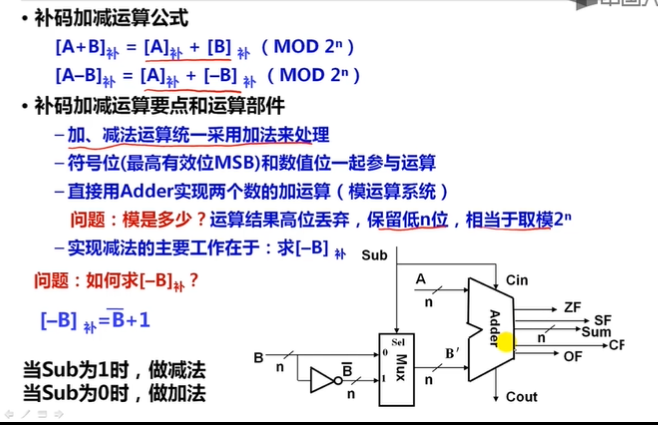

#### 整数减法

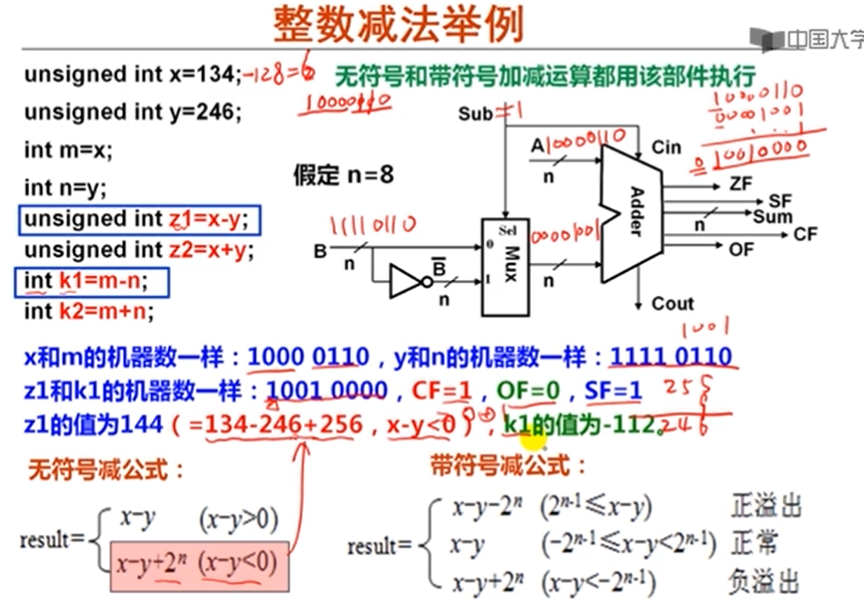

#### 整数加法

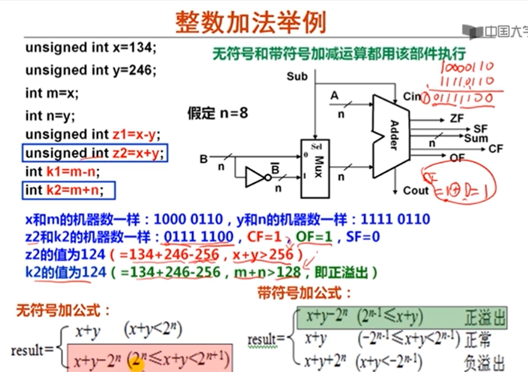

### 乘法：

**高级语言中两个n位整数相乘得到的结果通常也是一个n位整数，也即结果只取2n位乘积中的低n位**

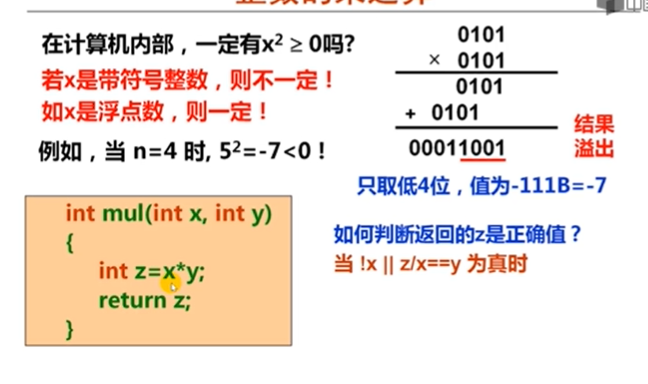

C语言程序员可以用高级语言判断乘法是否溢出。

而编译器判断溢出是用高n位的特点来判断。


无符号乘法和带符号乘法的区别如下：

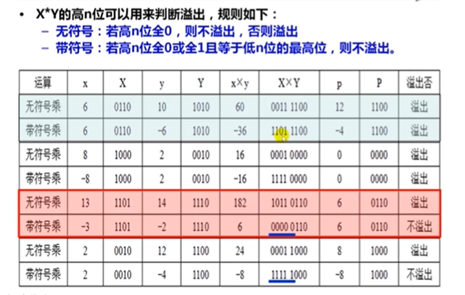

### 整数除法

-对于带符号整数来说，n位整数除以n位整数，除了$-2^{n-1} / -1 = 2 ^ {n-1}$会发生溢出外，其余情况都不会发生溢出。

-在不能整除时需要进行舍入，通常按照朝0方向舍入，即**正数**商取比自身小的最接近整数（**Floor**），**负数**商取比自身大的最接近整数（**Ceiling**）

-除数不能为0，否则会发生**异常**！

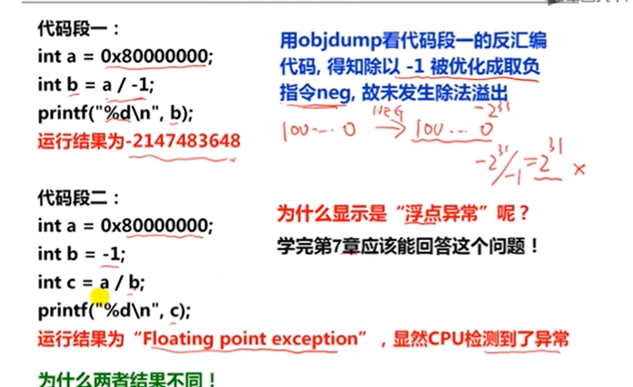

变量和常数之间的除运算

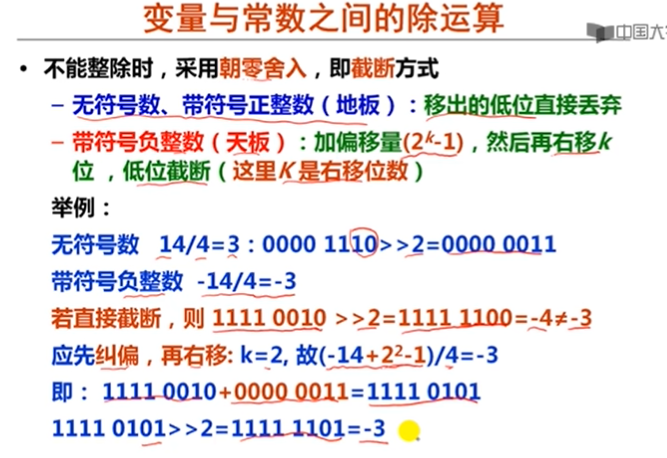

### 浮点数运算及结果

#### 	加减

​		首先看阶

- #### Kahan累加算法

  -  -- 解决大数吃小数，舍入精度问题

- ```c++
  sum = 10000.0;
  c = 0;
  y = 3.14159 - c;
  t = sum + y = 10003.1
  c = t -sum - y
    = -0.415900
  ```

- c表示每次加法带来的误差，这个误差可以加在下一次的加数上，得到精确结果


#### 	乘除

​		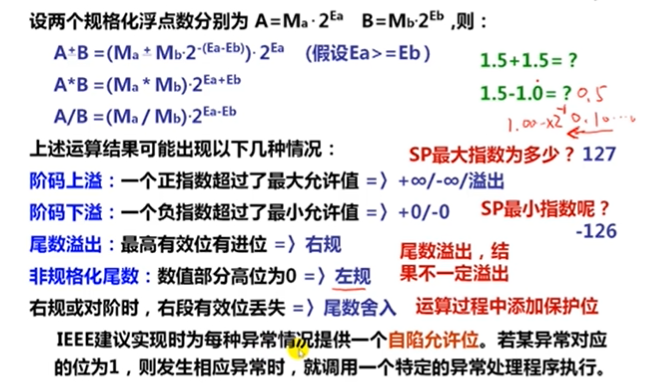

加法容易发生需要右规的情况，而减法容易发生需要左规的情况

#### IEEE 754标准规定的五种异常情况

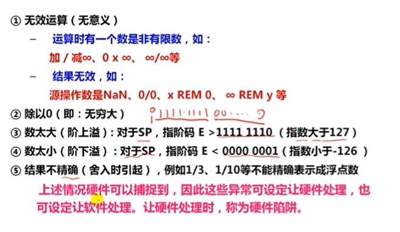

## 第三章

### IA-32指令类型概述

#### 定点算术运算指令

注：

汇编语言中指令的后缀b,w,l是用来确认操作数占用存储空间大小的:

①b是byte的意思,意味着操作数大小为1字节,相当于c语言的char类型; 即8位 2个16进制位

②w是word的意思,意味着操作数大小为2字节; 即16位 4个16进制位

③l是long的意思,意味着操作数大小为4字节,相当于c语言的long int类型; 即32位 8个16进制位

#### 	定点加法

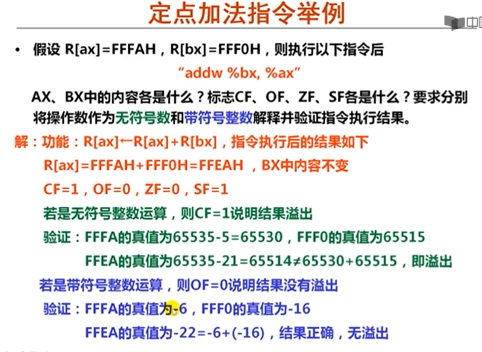

addw既可以看成无符号数运算也可以看成带符号数运算

#### 	定点乘法

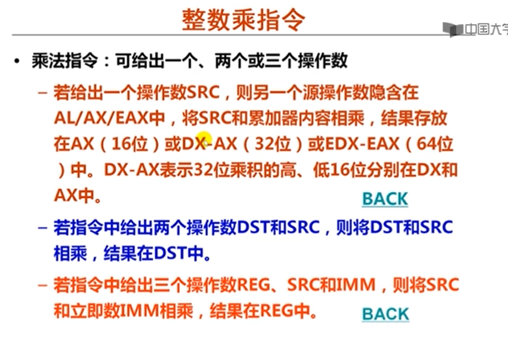

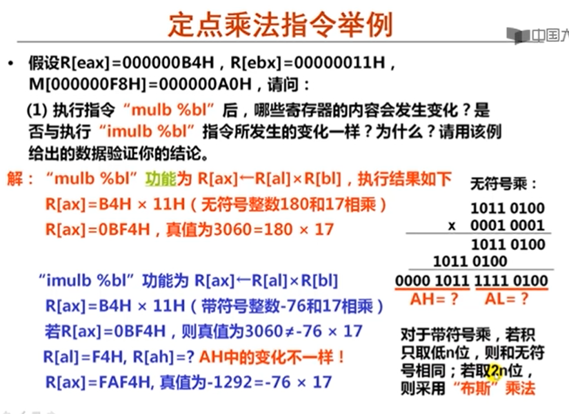

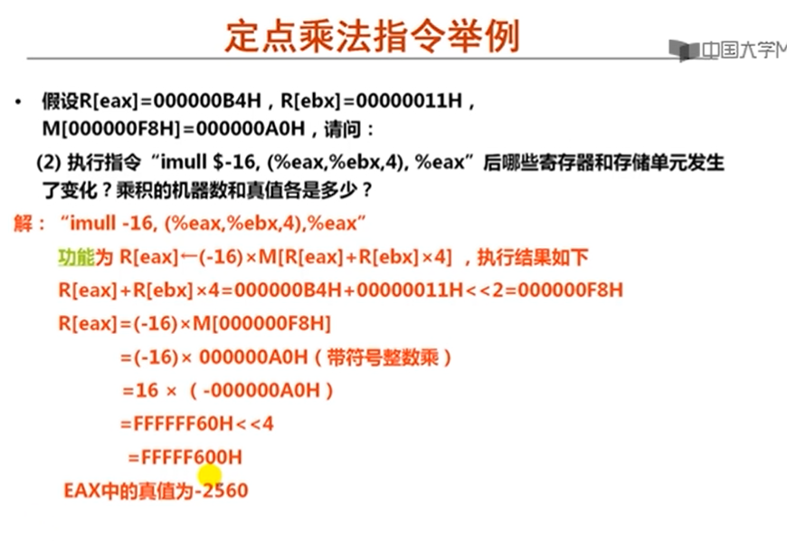

#### 	按位运算

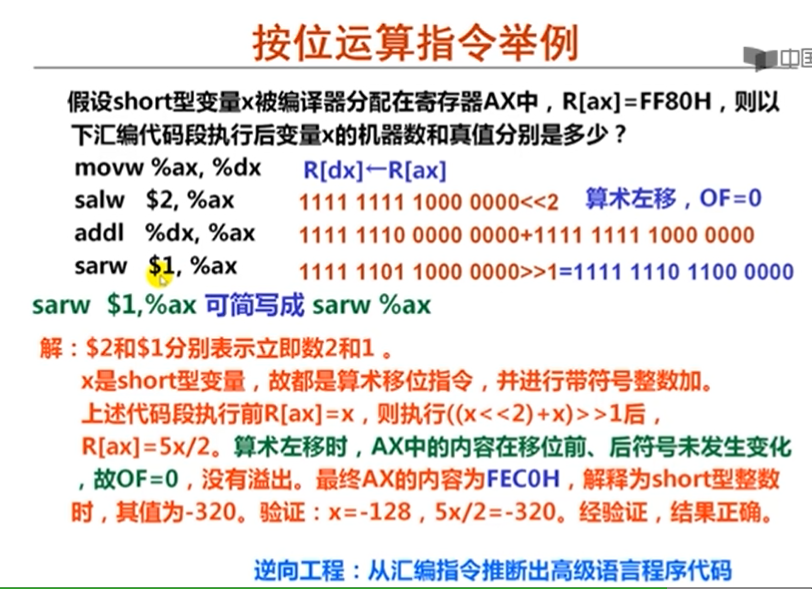

#### 	控制转移指令

​		无符号：b = below（小于） a = above（大于） e = equal（等于） n = not（不）

​		带符号：l = less （小于） g = greater（大于） e = equal（等于） n = not（不）

 j = jump（跳转指令），条件跳转指令是通过减法然后看标志寄存器来判断的

#### 	C表达式类型转换顺序

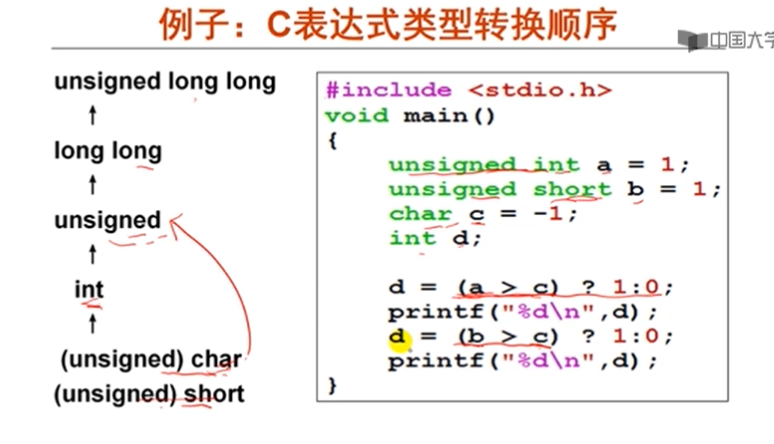

a > c 用unsigned的基准来比， 而b > c用int 的基准来比

### x87浮点处理指令

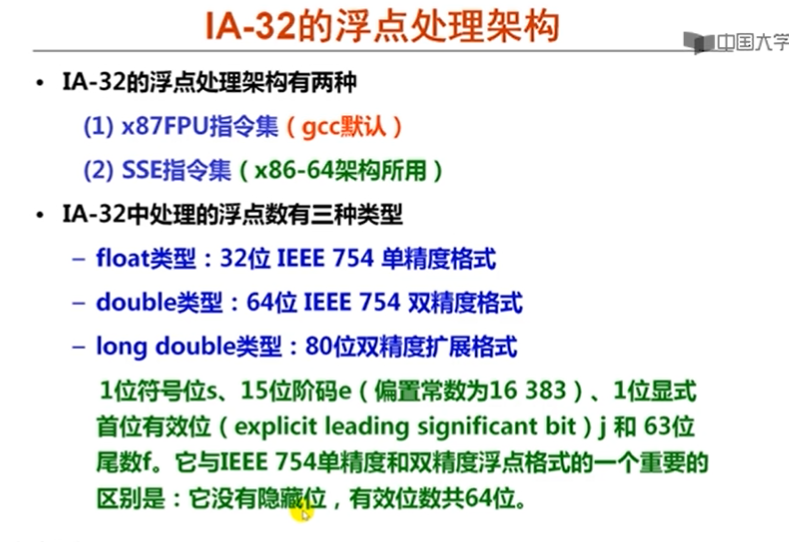

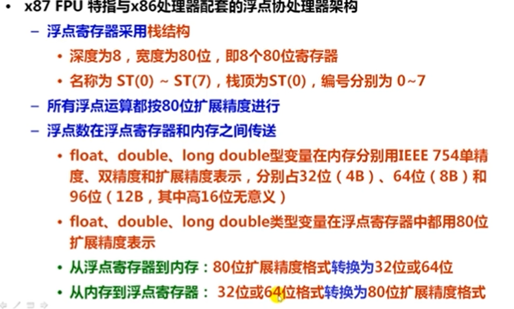

在调用完函数计算出结果后，若要再次计算得到结果，则要将先前结果存回内存，导致80位浮点数变成64位，造成精度损失。在比较时重新load到栈结果中，重新转换为80位。

### MMX（多媒体扩展）及SSE指令

了解即可

## C语言语句的机器级表示

### 过程调用的机器级表示

​	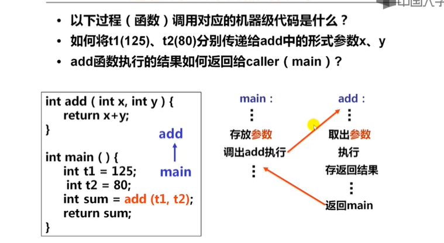

​	-参数通过栈来传递

​	-可执行文件映射到存储地址中

​	栈顶放在栈指针寄存器ESP中


​	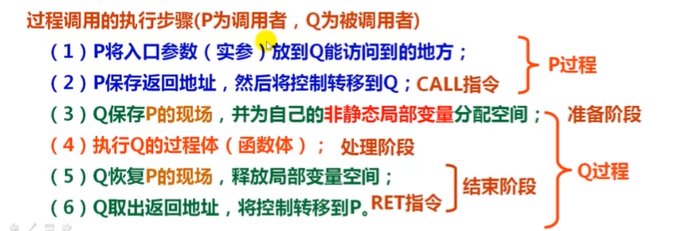

注：RET指令指的是return指令

​		  “现场”指的是通用寄存器的内容

​		  为什么要保存现场？因为所有过程共享一套通用寄存器

IA-32有8个寄存器，使用约定如下：

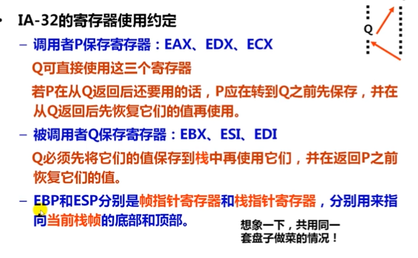

问题：为减少准备和结束阶段的开销，每个过程应优先使用：

- **EAX，EDX，ECX**

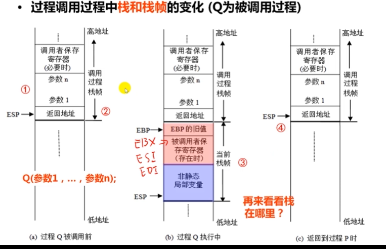

同时栈底不动，栈帧（栈顶）不断从高地址往低地址移动


汇编语言小记：加$的表示立即数，%后面表示寄存器 movl表示把第一个%寄存器里的内容移动到第二个%的寄存器中

一个小栗子：

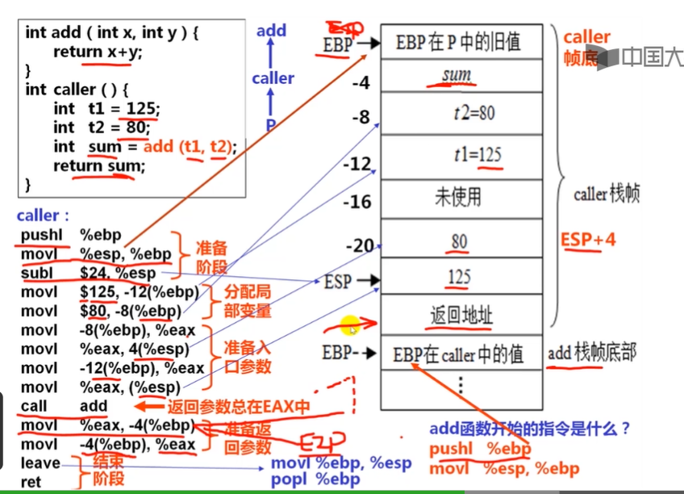

注1：在add函数开始时执行pushl指令后esp即指向最新的栈帧（如图所示），然后再movl指令把   esp的值赋给ebp

注2：返回值总是存在EAX中（默认的）

注3：EIP中存的是返回地址

注4：ret指令是退栈操作，包括movl和popl两个操作


### 10.11 过程（函数）调用的参数传递

***（画栈帧）（必考）***

#### 	生成/释放新栈帧

- 改变EBP（栈底寄存器）和ESP（栈顶寄存器）的指向即可
- 一般产生新栈帧规定动作
  - push ebp
  - move esp ebp
- ret前，一般用lea指令 = move ebp esp + pop ebp（把esp指向内容送到ebp）
- ret = pop eip（把esp指向内容送到eip）
- push和pop都会改变esp（一个是减一个是增）


- switch语句的机制是要有一个跳转表，预先存放各个跳转地址）


## 指令解构

- 8位的指令操作码和16/32位不一样，但16位和32位的操作码相同，通过操作码前缀0x66来区分
- 00 e9 ff ff -》 -0x2000
  1111 1111 1111 1111 1110 1001 0000 0000
- 0000 0000 0000 0000 0001 0111 0000 0000
- 一个内存地址保存一个字节
- 汇编里面的条件跳转是不满足跳转，即先判断不满足的情况，然后再判断满足的情况
- lea和mov的区别
  - leal （%edx， %eax），%eax
  - 把edx和eax里的值加起来，去以这个值为地址，送到eax
  - mov是把edx和eax的值加起来，送到eax
- switch和if-else


#### 数组元素在内存的存放和访问

#### 结构体数据的分配和访问

#### 联合体数据的分配和访问

- 结构本质上是存放不同类型数据的数组，其汇编代码和数组没什么区别


### 数据的对齐

#### 背景

- 存储器可以看作连续的位（cell）组成，每8位构成一个字节，每个字节有一个地址编号，称为**按字节编址**。
- 在计算机中，每整数倍数编码的8个字节可以同时读写。如0-7位可以同时读写，8-15位可以同时读写。
- 所以数据在存储器中存放时需要进行对齐，以避免多次访存而带来指令执行效率的降低。
- 当然如果不对齐，底层机器代码也能正常读取数据，但是对齐是为了让程序的执行效率更高


#### 对齐策略

- 对于数据类型，最简单的对齐策略是按其数据长度对齐
- 微软Windows采用此对齐策略
  - 如short型地址是2的倍数
  - int、float型地址是4的倍数
  - double和long long是8的倍数
  - char不对齐
- Linux的对齐方式则更为宽松，除了short的地址是2的倍数外，其他的如int、float、double和指针等类型数据的地址都是4的倍数

- i386 System Ⅴ ABI对结构体数据的对齐方式有如下几条规则
  - 整个结构体变量的对齐方式与其中对齐方式最严格的成员相同
  - 每个成员在满足其对齐方式的前提上，取最小的可用位置作为成员在结构体中的偏移量，这可能导致内部插空
  - 结构体大小有应为对齐边界长度的整数倍，这可能导致尾部插空（比如尾部是char，那么会插空3位）
    - 前两条规则是为了保证结构体中的任意成员都能以对齐的方式访问
    - 第三条规则是为了保证使结构体数组中的每个元素都能满足对齐要求

- 数据区和指令区采用4kb对齐的原则
- 栈帧是16对齐，如果长度不够，则剩余部分为空，总之是要保证长度为16整数倍


#### 对齐方式的设定

```c++
#pragma pack(n)
```

- 为编译器指定**结构体**或**类**内部的成员变量的对齐方式
- 当自然边界（如int按4字节、short按2字节、float按4字节）比n大时，按n字节对齐
- 缺省或#pragma pack()，按自然边界对齐

```c++
struct demo{
    char x2;
    int x1;
    short x3;
    long long x4;
}__attribute__((aligned(m)));
```

- 为编译器指定一个结构体或类或联合体或一个对象变量的对齐方式
- 并且让对齐位数高于m的数据必须从m的整数倍地址开始存储（不能跨）
- 宏定义和attribute定义可以混合


#### 越界访问和缓冲区溢出

注：main函数第一个语句声明的整型变量在指令（mov ebp imm）里，因为此时栈帧还没形成；如果声明的是浮点数，浮点数数据存在只读（代码）区中，在mov指令中的operand是一个地址。

- C语言中的数组元素可使用指针来访问，因而对数组的引用没有边界约束
- 数组存储区可看成一个缓冲区，超越数组存储区范围的写入操作成为缓冲区溢出
- **缓冲区溢出攻击**是利用缓冲区溢出漏洞所进行的攻击行动。

##### 防范

- 从程序员的角度去防范
- 从编译器和操作系统方面去防范
  - 地址空间随机化ASLR
  - 栈破坏检测
  - 可执行代码区域限制
  - ...

#### 程序的加载和运行

- UNIX/Linux系统中，可以通过调用execve()函数来加载并执行程序

- ```c++
  int execve(char *filename, char *argv[], *envp[]);
  ```

  - filename是加载并运行的可执行文件名(如./hello)，可带参数列表argv和环境变量列表envp

## 第四章 链接

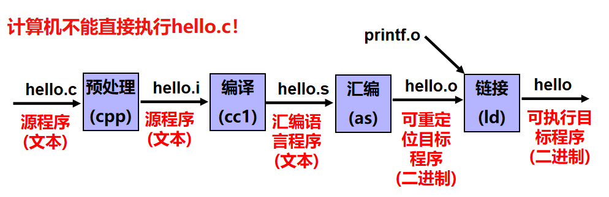

- ELF文件结构
  - ELF文件头（固定长度）
  - 代码的二进制表示
- .o文件除了常规代码外，还包含许多额外信息

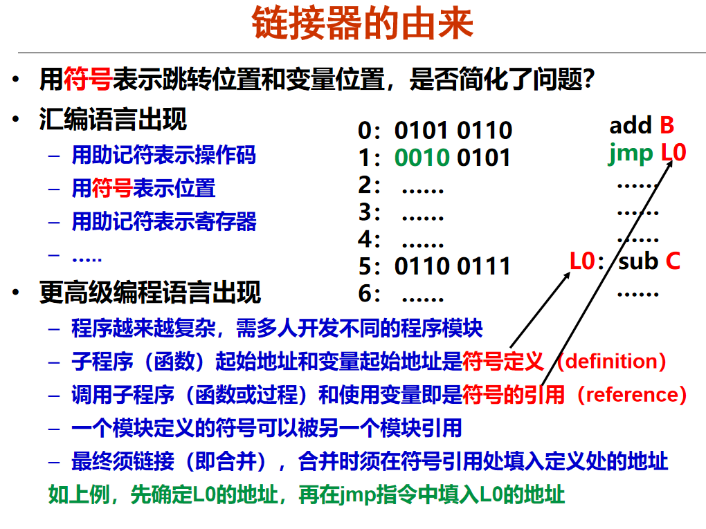

### 链接操作步骤

- 确定标号引用关系（符号解析）
- 合并相关.o文件
- 确定每个标号（包括函数和全局变量）的地址
  - 在.o文件里会有一个符号表（编译器干的），包含符号的地址
  - 还有一个重定位表，记录符号的引用被替换的信息
- 在指令中填入新的地址

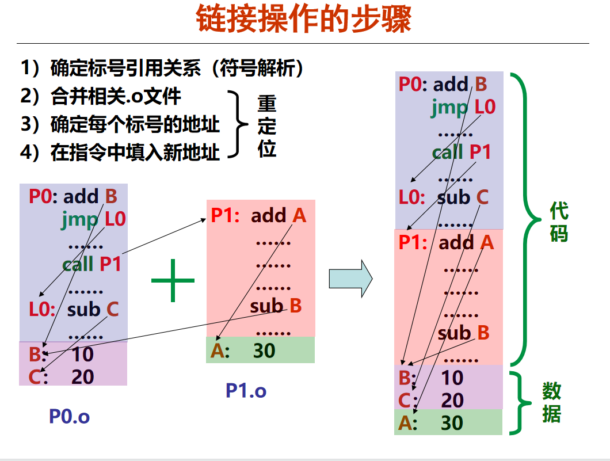

### 链接的好处

- 模块化
  - 一个程序可以分成很多源文件
  - 可构建公共函数库，如数学库、标准C库等
- 效率高
  - 时间上，可分开编译	
    - 只需重新编译已修改的文件，然后重新链接
  - 空间上，无需包含共享库所有代码
    - 源文件不需要包含共享库的源代码，只需要调用其中的函数即可


### 目标文件格式

指编译器和汇编器处理源代码后所生成的机器语言目标代码

- ELF（Executable and Linkable Format）
- 可重定位目标文件
  - 其代码和数据可和其他重定位文件合并为可执行文件
    - 每个.o文件由对应的.c文件生成
    - 每个.o文件代码和数据地址都从0开始
- 两种视图
  - 链接视图（被链接）
    - 节（section）是ELF文件中具有相同特征的最小可处理单位
      - 关键是有一个节头表，节头表定义和包含了节的所有信息
      - .text节 代码
      - .data节 数据
      - .rodata节 只读数据
      - .bss节 未初始化数据
  - 执行视图（被执行）
    - 由不同的段（segment）组成，描述节如何映射到存储段中，可多个节映射到同一段，如：可合并.data节和.bss节并映射到同一个段中

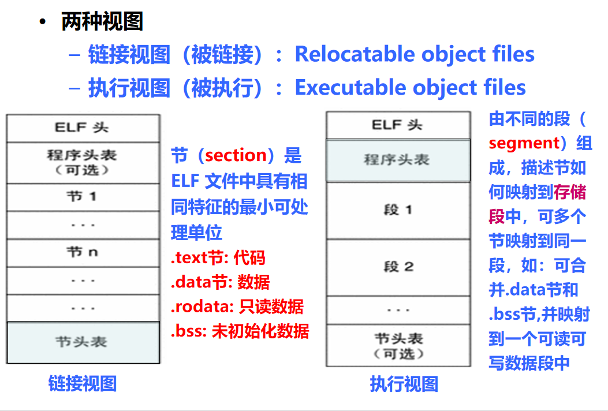

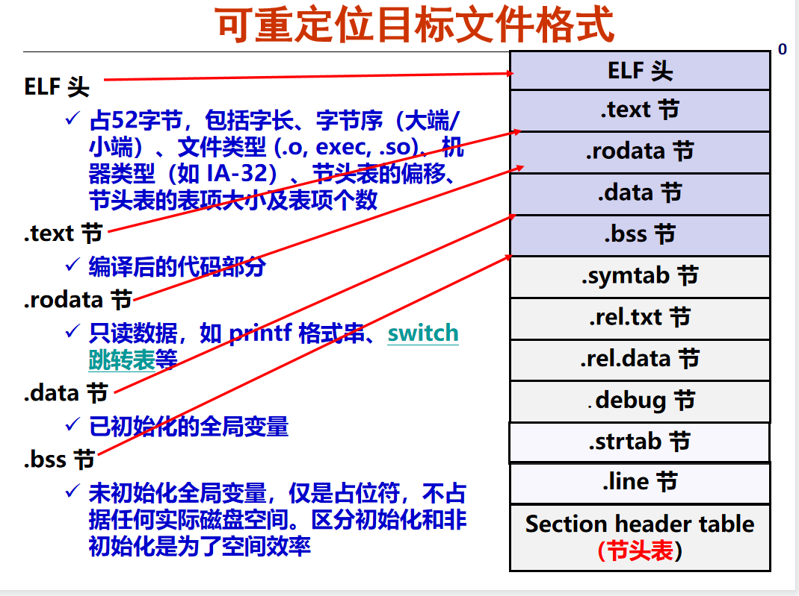


### 符号解析

- 符号分为强符号和弱符号
- 如果是强符号，是其他文件的符号来往此处靠
- 如果是弱符号，则优先在其他文件中找是否以已经有定义

### 重定位

- 可重定位目标文件中的代码区和数据区都是从地址0开始的，链接器需要将不同模块中相同的借合并起来生成一个新的单独的节，并将合并后的代码区和数据区按照ABI规范确定的 **虚拟地址空间划分（也称存储器映像）**来重新确定位置

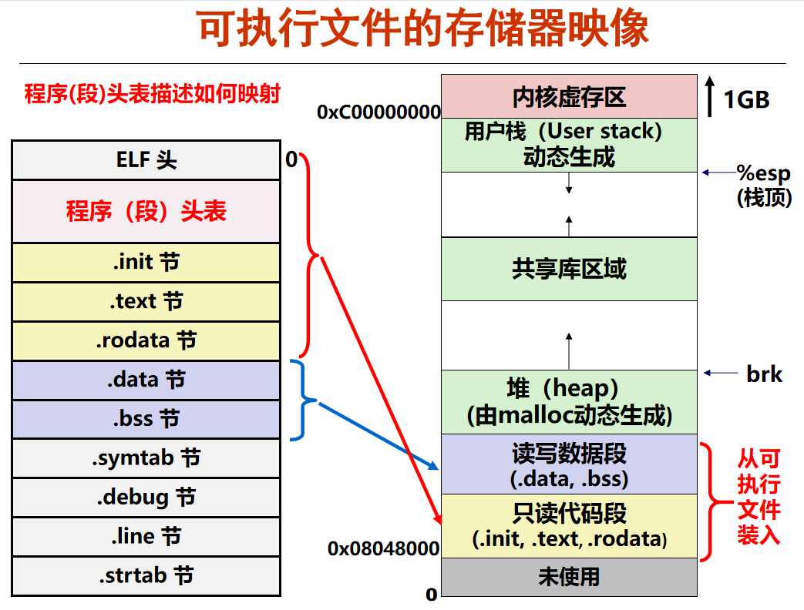

#### 步骤

- 合并相同的节
  - 将集合E的所有目标模块中相同的节合并成新节
- 对定义符号进行重定位（确定地址）
  - 确定新节中所有定义符号在虚拟地址空间中的地址
  - 完成这一步后，每条指令和每个全局变量都可确定地址
- 对引用符号进行重定位（把用到符号的地方替换成地址）
  - 修改.text节和.data节中对每个符号的引用

汇编器对引用的处理：

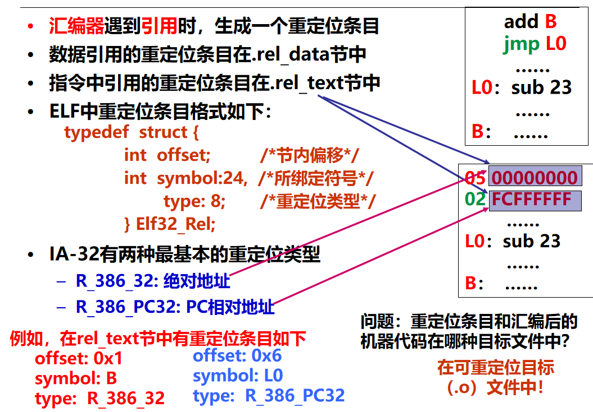


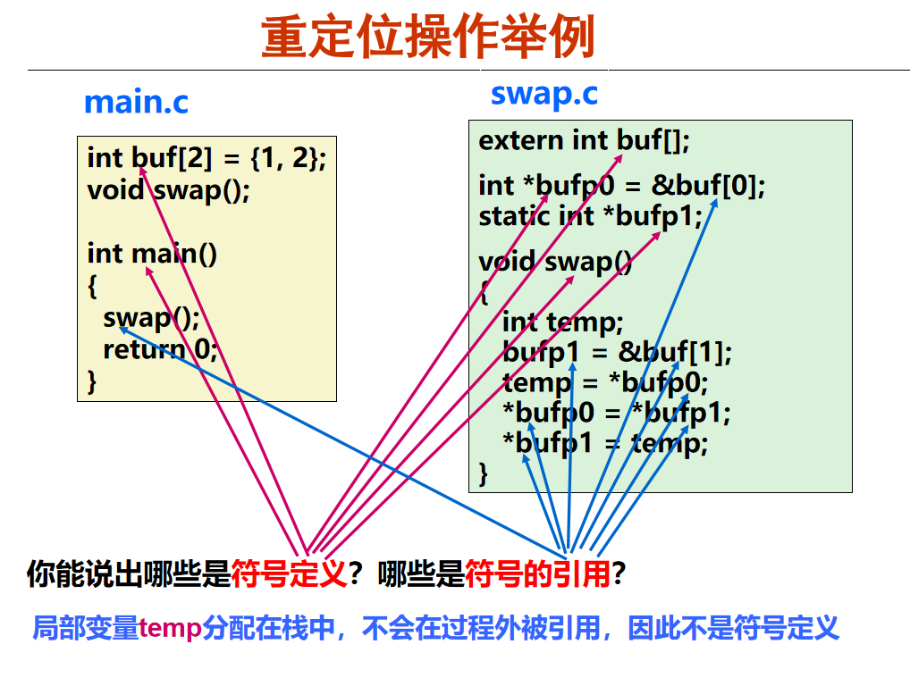

bufp0一行即为数据区的重定位；代码区的重定位则分为函数的重定位和全局变量的重定位。

- 一个栗子

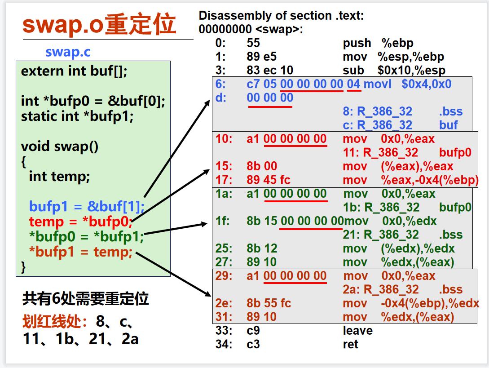

buf的地址 + 0x4（数组的偏移量）再替换【蓝字部分】

10表示把bufp0的值放入eax，15表示*bufp0，即把eax中地址中的值放入eax

【汇编中加（）相当于高级语言的*操作】

【汇编的数前加$表示立即数，否则表示内存地址】


- 通常解题步骤

  - 先看高级语言，定位代码区和数据区需要重定位的符号
  - 对应看汇编语言，关注mov 0x0和call 指令，可能是重定位
  - 写出重定位表：偏移量 + 重定位符号 + 重定位类型

  tips：在重定位替换符号引用的时候，要加上初始值


- 代码区放的是一条条指令
- 数据区放的是全局变量的初始值（如果没有初始化则原来这块内存是多少现在就是多少）

### 动态链接

- 数据区里，有8个字节存储未初始化的全局变量，这8个字节在文件里不占空间。但是当其装载到物理内存中时，占空间。

- 动态链接的特点及好处

  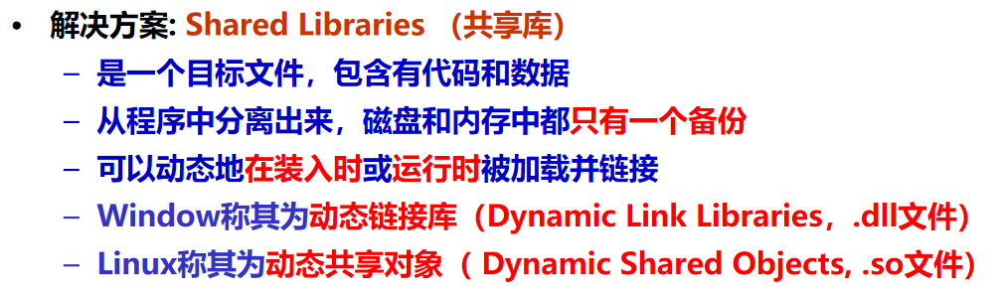

- 动态链接必须是位置无关代码（PIC）
  - PIC
    - 保证共享库的代码位置可以不确定
    - 即使共享库代码的长度发生变化，也不影响调用它的程序


- 模块内部的过程调用、跳转，采用PC相对偏移寻址


- 模块内部数据引用

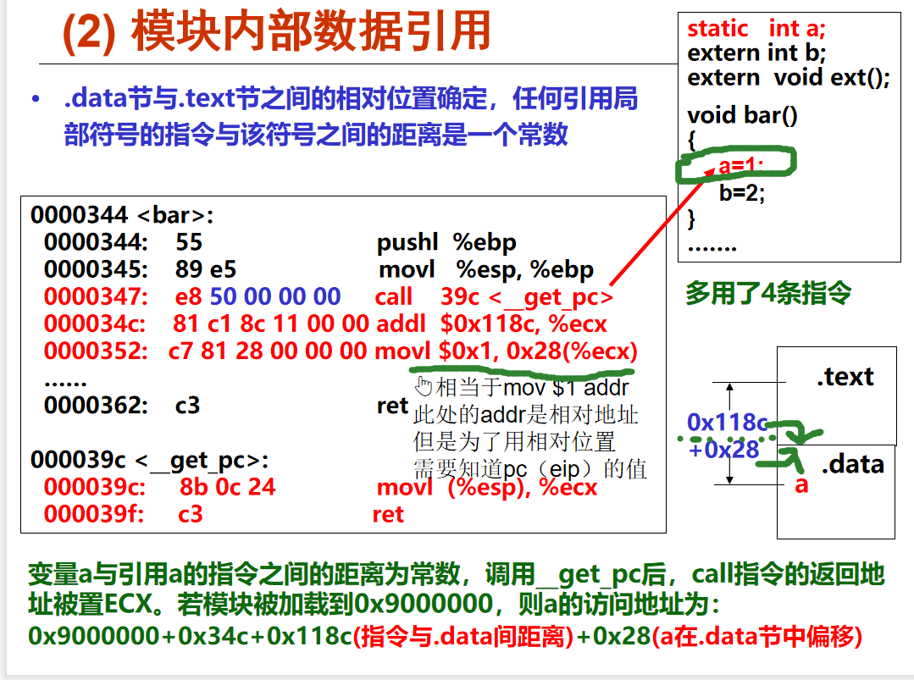

- 模块外的过程调用、跳转

  - 方法一：使用类似（3）的GOT表
    - 优化：使用lazy binding延迟绑定技术，不过需要多使用延迟偏移表

  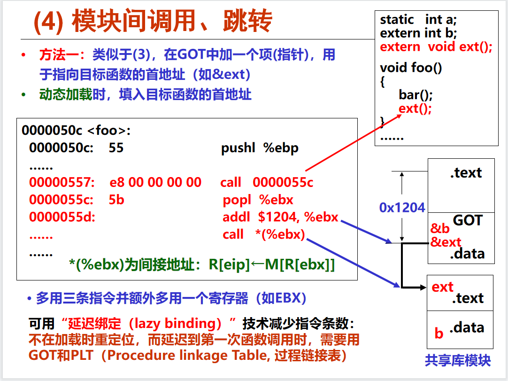

  - 方法二：延迟绑定
    - GOT是data，PLT是text


- 模块外的数据访问，如外部变量的访问
  - 使用全局偏移表（GOT），实际上就是一个指向外部全局变量的指针。

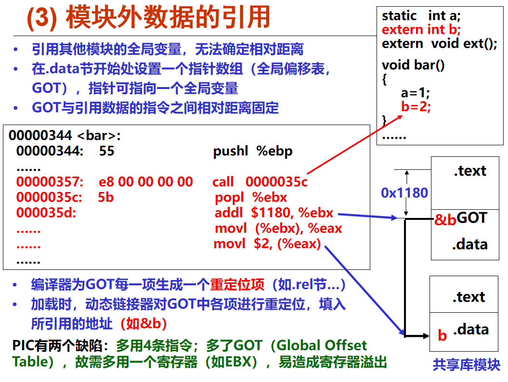


