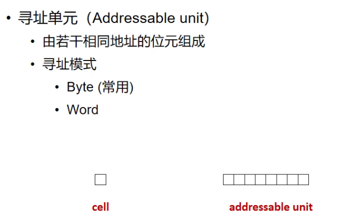
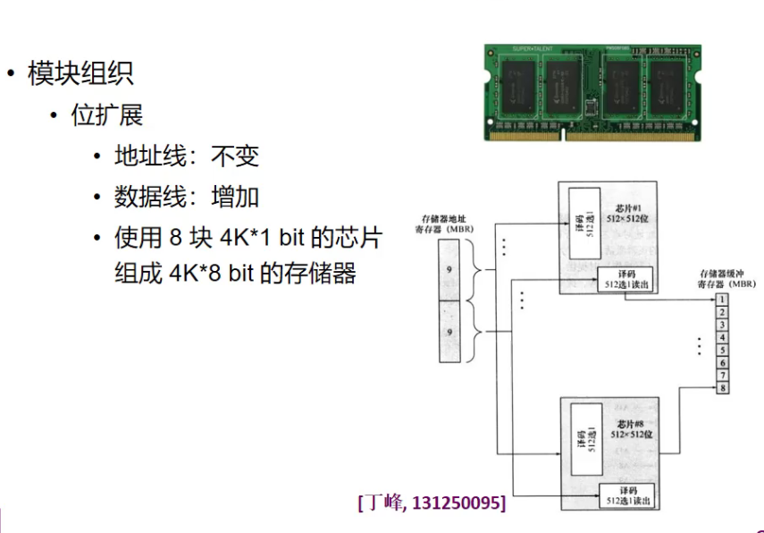

# 计算机组织与结构

## chapter1

### 什么是计算机？

-**通用电子数字计算机**

-通用：不是一种专用设备，所有计算机在给予足够时间和容量存储器的条件下，都可以完成同样的计算。党希望完成新的计算时，不需要对计算机重新设计

### 计算机系统

-硬件：处理器、存储器、外部设备

-软件：程序、文档

### 组织与结构

组织：对编程人员不可见

结构：对编程人员可见

### 计算机简史

#### 第一代：真空管

ENIAC：第一台通用计算机

EDVAC：采用冯.诺伊曼结构（普林斯顿结构）

​	冯诺依曼结构的三个基本原则：

​		-二进制

​		-存储程序执行

​		-五个组成部分

​			-主存储器：地址和存储的内容（important） 

​			-算数逻辑/处理单元：执行信息的实际处理

​			-程序控制单元：指挥信息的处理

​			-输入设备

​			-输出设备

#### 第二代：晶体管

体积更小、更便宜、发热更少，而且能以与电子管相同的方式建造计算机

使用更复杂的算数逻辑单元和控制器，使用高级编程语言

#### 第三代及后续几代：集成电路

#### 摩尔定律

​	-每18个月晶体管的数量增加1倍

### 计算机发展：变与不变

-

### 计算机性能

> #### CPU性能

-系统时钟

​	-时钟频率/时钟速度（单位：Hz）：计算机执行最基本操作的基本速率（以每秒周期数为单位）

​	-时钟周期/时钟滴答声：CPU的单个电子脉冲

​	-周期时间（单位：s）：两个脉冲之间的时间

​		-有时被称为**时钟周期**


> **但是有时，cpu会专门做一块硬件来处理某条特定的指令，使得这个特定的指令执行的特别快，显得cpu性能很好。为了防止这种以偏概全的作弊方法，并找到一种公平的方法来量化cpu性能我们引入**：

****

所以，有些常见的跑分软件的原理即：拿一堆基准程序来跑


$$MIPS = \frac{f}{CPI * 10^6}$$

## chapter2、计算机的顶层视图

### 计算机组件

​	-数据和指令存储在单个读写存储器

​	-该存储器的内容可按位置寻址，而无需考虑其中包含的数据类型

​	-从一条指令到下一条指令以顺序方式执行（除非明确修改）

### CPU

​	PC：程序计数器

​	IR：指令寄存器

​	MAR：存储器地址寄存器

​	MBR：存储器缓冲寄存器

​	I/O AR：I/O地址寄存器

​	I/O BR：I/O缓冲寄存器

​	执行单元

​	-问题：CPU在等待I/O设备时保持空闲

​	-解决方法：

​		-中断：其他模块（例如I/O)可以中断正常处理顺序的机制


​			-在等I/O 的时候中断以下去处理其他的程序，待I/O准备好以后，其打断CPU，让其继续未完成的			操作。

​			-中断程序全部处理完了之后，再回到用户程序，即：中断程序优先级更高

​			

### 存储器

​	问题：

​		-主存和CPU之间传输数据的速度跟不上CPU的速度

​		

​	解决：

​		-添加一级或多级缓存（cache）以减少存储器访问频率并提高数据传输速率（层次式存储结构）

​		-增大总线的数据宽度，来增加每次所能取出的位数

​		-...

​	约束：

​		-容量：越大越好

​		-速度：跟上存储器

​		-成本：相对于其他组件合理	

​		-约束之间的关系：更短的访问时间，更高的每比特成本


### I/O模块

​	-与CPU和内存交换从外部来源收集的数据

​	问题：I/O性能跟不上CPU速度的提升

​	解决：

​		-缓冲

​		-新的接口技术

​		-...

### 系统总线

​	-是连接两个或多个设备的通信通路


## chapter3、数据的机器级表示

### 编码：

​	定义：用少量简单的基本符号对复杂多样的信息进行一定规律的组合。

​	注意：不可能用离散有限的数据准确的表示连续无限的现实变量。


#### 	采用二进制的原因：

​		-多种物理器件可以表示两种稳定的状态，用于表示0和1

​		-二进制的编码和运算规则简单

​		-1和0可以对应逻辑命题中的“真”与“假”

### 数值型数据的二进制数表示：

#### 		整数类型

##### 					无符号整数

##### 					有符号整数：原码，反码，移码，补码

​						-补码的表示：略

​						-补码的解析：$[X]_C = X_nX_{n-1}...X_1 \to X = -X_n * 2^{n-1} + X_{n-1} * 2^{n-2}+...+ X_1 * 2^0$

#### 二进制编码的十进制数表示

> ***即NBCD码***

##### 好处和特点：

- 可以同时保证精度和表示范围
- 但是牺牲了位数（存储空间）

​				

#### 	浮点数的二进制数表示


​			-基即为2，约定俗称为2.

​			-规格化数的表示范围：

- 规格化数阶码的表示范围是$2^{-126} \sim 2^{127}$
- 阶码全0表示下溢区的数，而阶码全1表示上溢区 & $NaN$


此时计数：小数精度更高是因为，小数的相对偏差更大，精度要求更高。而大数精度要求较小，所以大数的精度可以稍微低一点

IEEE 754规定的舍入标准是**向偶数舍入**？


## chapter4、数据校验码

### 差错

​	-分类


### 纠错

#### 	基本思想：

​		存储额外的信息以进行检错和校正

#### 	处理过程：

​		数据输入：

​				-使用函数$f$在M位数据$D$上生成K位校验码$C$

​		数据输出：

​				-使用函数$f$在M位数据$D^{'}$上生成K位校验码$C^{''}$，并与取出的K位码$C^{'}$（因为此时$C$在				拿出来的时候也可能出错，产生$C^{’}$）进行比较

​		-没有检测到差错：使用数据$D^{'}$

​		-检测到差错且可以校正：校正数据$D^{'}$来生成数据$D^{''}$并用数据$D^{''}$

​		-检测到差错但无法纠正：报告


​		注意：数据在经过存储器/网络时会发生错误，经过存储器/网络后的数据会发生改变！

### 奇偶校验码

#### 	基本思想：

​		增加1位校验码来表示数据中的1的数量是奇数还是偶数

#### 	处理过程

​		假设处理数据$D=D_M...D_2D_1$

​		-使用抑或操作

​			-特点：0跟任何数异或后还是那个数，因此0对异或运算没有影响

​							 1和1异或生成1

​			-因此奇数个1异或后生成1，偶数个1异或后生成0

​		-奇校验：奇数个1生成0，偶数个1生成1（和原数据放在一起，1的个数是奇数个）

​		-偶校验：奇数个1生成1，偶数个1生成0（和原数据放在一起，1的个数是偶数个）			 

#### 		校验分析

### 			

总的来说，如果01位数出错了，但总体的奇偶性没变，则无法检测出来

也无法检测出来具体是哪一位出现了错误

而且发现了错误后无法纠正。

我们默认：较短长度（如1字节）的数据每次出错只会1位出错，因此奇偶校验码适用于较短长度（如1字节）的数据进行检错。

### 海明码

#### 		基本思想

​		-将数据分为几组，对每一组都使用奇偶校验码进行检错（可以是有重复的分组）

#### 		处理过程

​		-将M位数据分成K组

​		-数据输入

​			为数据$D$中每组生成1位校验码，合并得到K位校验码$C$

​		-数据输出

​			为数据$D^{'}$中每组生成1位校验码，合并得到新的K位校验码$C^{''}$

​		-检错：

​			将校验码$C^{''}$和取出的校验码$C^{'}$按位进行异或，生成K位故障字（syndrome word）

​	

数据位出错和校验码出错分别有M和K种情形

且我们假设数据出错和校验码出错不会同时发生。

通过设定M，我们可以求出需要K的最小值


#### 故障字的作用：

​	每种取值都反映一种情形（数据出错/校验码出错/未出错）

​	规则：

​		全都是0：没有检测到错误

​		有且仅有1位是1：错误发生在校验码的某一位，不需要校正（我们假设数据和校验码一起最多只有1位出错）

​		有多位为1：错误发生在数据中的某一位，将$D^{'}$对应数据位取反即可纠正。（得到	$D^{''}$（某一个数据参与且仅参与了多个组）


#### 校验分析


若故障字哪几位数值为1，则对应校验码出错（校验码$C_n$在$2^n$位上），说明其内有某个数据位出错。找出公共的数据位，即为出错的位


-我们先规定数据位/校验码与故障字的关系，然后由此可以推导出数据位的划分（如何分组）

### 循环冗余校验

​	适用于以流格式存储和传输大量数据

​	用数学函数生成数据和校验码之间的关系

#### 	基本思想

​		假设数据有M位，左移数据K位（右侧补0），并用K+1位生成多项式除它（模2运算）

​		采用K位余数作为校验码

​		把校验码放在数据（不含补的0）后面，一同传输和或传输

#### 	交错

​		如果M+K位内容可以被生成多项式除尽，则没有检测到错误

​		否则，发生错误


### 补充：模2除法

模除的意思是做除法取余数（除完不要结果只要余数）
模x除，说的是除以几取余数。例如模10除就是除10取余，例如100做模十，余数就是0。不过人类一般是用十进制的，计算机用二进制的，所以这里的模x又有用x进制的意思了，例如100模二，结果仍然是0（这里是二进制数字100也就是十进制的4）
计算机模二除用的是异或运算，因为按位异或的结果与除法结果相同。


模2除法的特点就是：每一位除的结果不影响其它位，即不向上一位借位

模2除法原则：1、被除数的首位为1，商为1

​								2、被除数的首位为0，商为0
​    
​								3、模2除法等同于按位异或，要保证每次除完首位都为0，才能进行右移
​    
​								4、计算时每次右移一位，当被除数的位数小于除数，其为余数

​								5、如果右移后，被除数首位为零，就除以全零


## chapter5、整数运算

### 算术逻辑单元（ALU）

### 全加器（最基本的单元）

#### 	串行进位加法器

​	-作用：完成一位（1 bit）的加法


$C_i$表示的是三个与运算做完后完成或运算（注意，这里的三个与运算可以同时进行）

但是$S_i$的抑或的有先后顺序的，x和y先异或好准备就绪，等着$C_{i-1}$

求$C$的延迟：$1ty + 1ty = 2ty$

求$S_i$的延迟：$3ty + 3ty = 6ty$

而计算异或时是要考虑同步的


#### 一个计算延迟的栗子


but 在$S_1$和$S_2$时，仍然是$6ty$，不满足$2n+1$。

#### 	

#### 	全先行进位加法器


**注：$P_i$为进位传递，$G_i$为进位生成**

**注：$C$是先做与再做或**


步骤1：先求所有的P和G —— 1ty

步骤2：求C —— 2ty **（和步骤1 异步）**

步骤3：X和Y异或—— 3ty **（步骤1、2和步骤3是同步的）**

步骤4：把步骤3的结果和C做异或，求得S **（和步骤1、2、3是异步的）**


##### 改进：


最后还要得到一个$C_{32}$，所以最后再还有一个（2+3）= 5ty


### 两种判断溢出的方法


注：溢出只可能发生在$X_n$和$Y_n$同号的情况下


### 减法电路


注：Mux指的是多路选择器（multiplexer）

​		 此电路把加法和减法做了一个统一，通过Sub信号决定多路选择器选择Y还是Y的	  取反


### 乘法


手工演算二进制乘法其实很类似手工演算十进制乘法

如果$Y_i = 0$，只执行移位操作

#### 一个栗子


注：把部分积P和乘数Y存在一个寄存器里面，因为Y和P的位数此消彼长，始终满足长度之和位2n的关系，所以如此操作可以充分利用存储空间

***例子***


**问题**：乘法在补码中可能会失效👇


***解决方法***：**布斯乘法**


把补码表示的Y用真值表示公式展开

精妙之处在第三行，利用变形使得式子形式统一（$Y_0 = 0$）


注1：第二点的意思是：$Y_i-Y_{i+1}$有$0,-1,1$三种取值可能，所以可能会对部分积产生三种影响

注2：应该使用带符号整数的算术右移，即sign_ext(始终保证右移是除以2的操作)


### 除法

#### 	恢复余数除法：


先把除数右移，让其最高位和被除数的次高位对齐

然后不断的把除数右移，商左移（商左移时通过控制逻辑判断是补0还是补1）


##### 优化

​	观察到余数（被除数）和商也满足此消彼长的关系，故将它们放在一起存储


PS：-7 / -2 = -3 ... -1

***余数减去除数之后，符号不能改变！***

***总之是要让余数的绝对值不断变小且让其符号不改变***


标红的一点即为:把商取反+1.


##### 一个栗子


我们判断是否"够减"时不是直观肉眼观察的, 而是先计算(同号相减、异号相加)，然后看结果相对于余数符号是否改变。若改变了则恢复，商0；反之保留运算结果，商1。

##### 思考：

有时候余数的符号会不等于初始被除数的符号，此时判断够减是以原始被除数的符号为准还是以余数的符号为准？

​	-看书上的栗子好像是以初始被除数的符号为准


#### 不恢复余数除法

​	基本原理


即如果余数和除数符号相同，左移减。否则左移加


##### 一个栗子


不恢复余数除法是直接对齐的，且第一次运算得到的是溢出位，不是真正的商，到最后要左移一位把其去掉

##### 思考：

有时候不恢复余数除法会失效，什么时候？如何解决？

- 如果中间余数结果出现全0时，到底是判为够减还是不够减

- 正好整除的时候失效，因为不恢复余数除法使用于有余数除法，其结束运算标准是除的次数，而不是余数是否为0


## chapter6、浮点数运算

### 加法和减法

- 流程图
- 其中有大量的判断来辅助程序节省运算（如红圈中的significand = 0？return other number ： continue exponents loop）
- 对阶、尾数加减后，如果尾数为0，说明相加的两个数互为相反数。此时要把exponent置0，然后再把结果（+-0）return
- 如果阶码溢出，返回无穷时，要把尾数清0
- 如果在规划化中间结果的时候，发现阶码为全0了，此时即结果变成了非规格化数，此时尾数要右移一位，保证和阶码$2^{-126}$对应。
- 注意：IEEE 754所能表示的最小数为$2^{-149}$，因此当数比此数还小的时候，判作下溢为0


- 对阶（保证两个阶码是相同的）

  - 原则是把小阶变大，尾数右移（原因是右移的时候可能高位会溢出，造成较大的精度损失）

- 尾数加减

  - 即为定点原码小数的加减运算（注意：所得结果也是原码！）
  - $X - Y = X + [Y]_{补}$
    - 若结果产生了进位，表示减法得到的结果和X同号，所得结果即为所求。
    - 若结果没有产生进位，表示减法得到的结果和X异号，得到的是数值为的补码形式，将所得结果求补重新化为绝对值原码形式，并把符号位取反，即得所求。

  

- 尾数规格化

  - 考虑保护位

- 尾数的舍入处理

  - 保护位100采用舍入到偶数
  - 就近舍入
  - 朝正无穷舍入：正数+1，负数舍掉
  - 朝负无穷舍入：正数舍掉，负数-1
  - 朝0舍入：全部舍掉

- 溢出判断

#### 一个栗子


### 乘法


如果上溢直接报错，如果下溢的话要先判断是否是非规格化数，然后再判断是否是下溢到0


### 除法


## chapter7、十进制运算

### 加法

#### 运算方法


当被加数超过10时，无论是在10 - 16还是16 - 18之间，都应该+6（0110）进行补偿

补偿数推导原理

```
x - 10 = y + x -16

x + y - 16 = x - 10

-> y = 6
```

#### 补偿硬件实现

- 模拟一位十进制的加减（四位二进制数）
- S2和S1位下面连的线就是实现+6（0110）的操作
  - 当C4旁边的或门信号为1时，加0110
  - 实现原理
    - C4为1，表示加法的4位结果在16 - 18之间
    - C4为0，但是S3为1，S2和S1至少有一个为1（表现为两个与门）


### 减法

#### 运算方法


- 模仿二进制运算，求十进制补码
  - 先十进制“取反”
    - 第一种方法：先按位反转，再加1010(10)
      - 推导：$9 - x = 15 - x + y - 16 \to \ y = 10$
    - 第一种方法：先加0110(6)，再按位反转
      - 推导：$9 - x = 15 - (x + y) \to \ y = 6$

##### 栗子

- 

先转十进制补码，然后加，然后按照加法处理的方法看是否需要加


## chapter8、内部存储

### 定义

  

- 注：寻址能力的真正含义应该是计算机可识别的存储单元位数。

### 存储器层次结构


- 越上面表示它越靠近CPU

### 半导体主存储器

- 以半导体芯片作为主存储器是最主流的做法
- 位元（Memory cell）：半导体存储器的基本元件
  - 特性：
    - 呈现两种稳态（获半稳态），分别表示二进制的0和1
    - 至少能被写入数据一次，用来设知状态
    - 能够被读取来获得状态信息


- 类型


#### 随机存取存储器

（Random Access Memory）

- 可以简单快速地进行读/写操作
- 易失的（volatile）

- 动态（dynamic）ram / 静态（static）RAM


- 静态可以保证不漏电（状态稳定，不需要刷新）


DRAM和SRAM的对比


##### 更高级的DRAM架构

- 类型
  - 同步DRAM，Synchronous DRAM
  - 双速率SDRAM，Double-Data-Rate SDRAM，DDR SDRAM（DDR）

传统DRAM是异步的，它要等待地址、控制信号、执行功能的延时，等待延时后，才能被读出或写入数据


- 每个时钟周期发送两次信号
- DDR2、DDR3...等做出的改进主要是缩短每次时钟周期的时间

#### 只读存储器(ROM/PROM)

- 特性
  - 非易失的（nonvolatile），不要求供电维持数据
  - ROM可读（不可以被修改）
- 应用
  - 微程序设计，库子程序，系统程序，函数表，**用于做保存出厂设置的系统盘**
- 问题
  - 固化数据需要较大的固定成本
  - 无出错处理机会：如果有一位出错，则整批ROM芯片只能报废
- ROM在出厂的时候已经写好，后续不可写

#### PROM

Programmable ROM

- 非易失的
- 只能被写入一次
  - 写过程是用电信号执行
  - 需要特殊设备来完成写或“编程”过程
- 好处：可以自己完成写的过程，写完之后仍然不可改
- 与ROM的对比
  - PROM提供了灵活性和方便性
  - ROM在大批量生产领域仍具有吸引力

#### 主要进行读操作的存储器

Read-Mostly Memory

- 特性
  - 读操作比写操作频繁得多
  - 非易失的
- 类型
  - EPROM（尽管命名后缀是ROM，但不是只读的，应该是RMM）
  - EEPROM（同上）
  - Flash memory

##### EPROM

Erasable programmable read-only memory

光可擦除/可编程只读存储器

- 特性
  - 光擦除，电写入
    - 擦除：在写操作之前把封装芯片暴露在紫外线下
      - 所有的存储单元都变回相同的状态
      - 每次擦除需要约20分钟
    - 注：重新写不能直接覆盖已有内容，要先把已有内容清楚再写入
- 和PROM对比
  - EPROM更贵，但它具有可多次改写的优点

##### EEPROM

电可擦除/可编程只读存储器Electrically erasable programmable read-only memory

- 特性
  - 可以随时写入而不删除之前的内容
  - 只更新寻址到的一个或多个字节
  - 写操作每字节需要几百微妙
- 与EPROM对比：
  - EEPROM更贵，且密度低（集成度低），写速度慢，支持小容量芯片

#### 快闪存储器

Flash Memory

- 特性
  - 电可擦除
  - 擦除时间可达几秒，比EPROM快多了
  - 可以在块级擦除，但不能在字节级擦除
  - 达到与EPROM相同的高密度（与EEPROM相比）
- 与EPROM、EEPROM对比
  - 价格和功能介于EPROM和EEPROM之间


### 回顾

- 寻址单元
  - 由若干相同地址的委员组成
  - 寻址模式
    - Byte
    - Word

cell相当于一个床位，addressable unit相当于一个房间，一个房间共用一个地址






- 黑色芯片焊在绿色内存板上即为内存条
